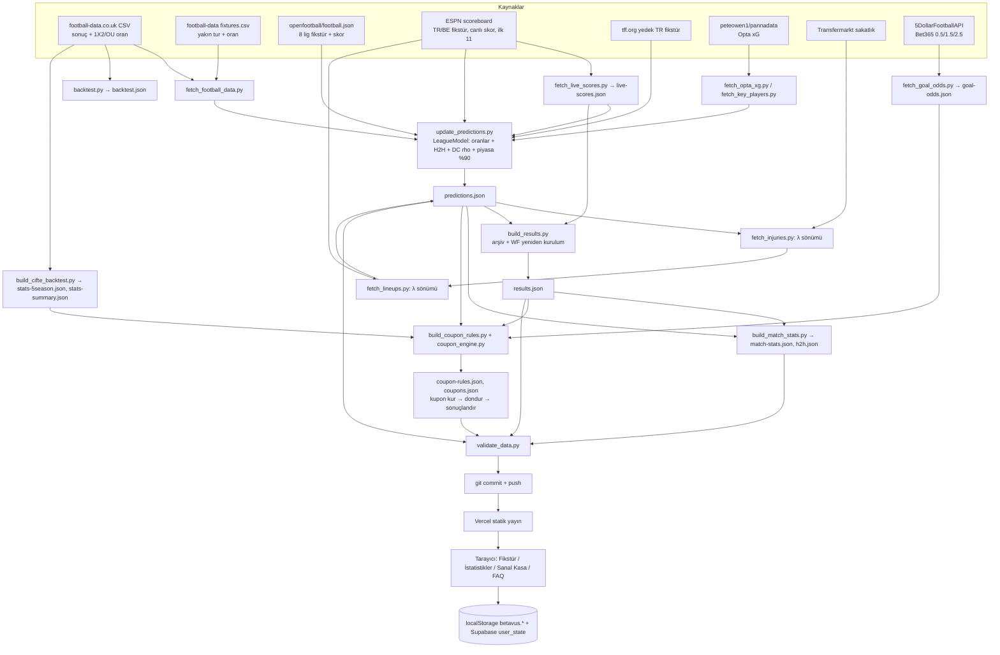

# BETAVUS — Bağımsız Sistem Raporu

> **Hazırlanma tarihi:** 2026-10-02
> **İncelenen kod:** `GKHNKMR/Football-TG05`, `main` dalı, commit `371a24b` ("Update BETAVUS predictions 2026-10-02", bot commit'i). Çalışma ağacı temizdi; rapor dışında hiçbir dosya değiştirilmedi.
> **Veri durumu:** Repodaki JSON/CSV dosyaları bot tarafından en son 2026-10-02 01:24–01:26 UTC'de üretilmiş. En son oynanmış ve sonuçlanmış maç **2026-09-20** (10 ligin tamamında). 21.09–08.10 arası milli ara nedeniyle maç yok; sıradaki maçlar 2026-10-09'da başlıyor.
> **Yöntem:** Kod, git geçmişi (723 commit, 390'ı bot dışı), dokümanlar, iş listesi (`BETAVUS_Is_Listesi.xlsx`) okundu. Repo verileri üzerinde salt-okuma Python betikleri çalıştırıldı. Betikler geçici klasördeydi, repoya yazılmadı (Ek D).
> **Gizlilik:** API anahtarları, erişim kodu, Supabase adres/anahtarları ve kişisel veriler rapora alınmadı.

Kısaltmalar: **ÇŞ** = Çifte Şans (1X / 12 / X2). **0.5+ / 1.5+ / 2.5+** = maçta toplam golün sırasıyla 0,5 / 1,5 / 2,5'in üstünde olması. **λ** = beklenen gol. **Vurgu** = sistemin "seçim" dediği şey: sitede yeşil yanan, eşiği geçen tahmin. **WF** = walk-forward (ileriye yürüyen test). **BE** = başabaş isabet (1 / ortalama oran).

---

## 0. Yönetici özeti

### Sistem ne yapıyor
BETAVUS futbol maçları için **olasılık yayınlayan statik bir web sitesidir** (https://betavus.vercel.app). Gerçek bahis oynamaz ve kimseye emir göndermez. Kendini "paper-betting / sanal kasa" platformu olarak tanımlar (README.md:159-160).

- **Kapsam:** 10 lig. Premier League, Championship, LaLiga, Bundesliga, Serie A, Ligue 1, Eredivisie, Süper Lig, Primeira Liga, Belçika Pro League (`scripts/teams.py:8-19`).
- **Pazarlar:** Maç toplam golü **0.5+ / 1.5+ / 2.5+ Üst** ve **Çifte Şans 1X / 12 / X2**.
- **Model:** Takım bazlı Poisson ve Dixon-Coles düzeltmesi. Son 8 karşılaşma (H2H) %28 ağırlıkla harmanlanır. Maçın 2,5 Üst/Alt bahis oranı varsa toplam beklenen golün **%90'ı piyasadan** alınır (`goals_model.py:44`).
- **Seçim:** Sabit olasılık eşiğini geçen tahmin "vurgu" olur. Eşikler: 0.5+ ≥ %93,5 · 1.5+ ≥ %83 · 2.5+ ≥ %75 · 1X ≥ %80 · 12 ≥ %80 · X2 ≥ %78. Kısıtlı veri hariç tutulur.
- **Kupon:** Bot her maç günü ve her risk profili için en fazla 5 vurgudan bir kombine kurar. Kombinenin toplam oranı, profilin günlük büyüme hedefinin gerektirdiği orana (1,30–1,50) ulaşmalıdır.
- **Bahis tipi:** Kombine (2–5 maç). "Stake" = profilin rezerv dışı payı kadar sanal kasa. Kasa her kullanıcının tarayıcısında / Supabase hesabında tutulur.
- **Ne zamandan beri canlı:** Bugünkü statik mimari **2026-09-09**'da canlıya alındı (`df6c711`). Maç öncesi tahmin arşivinin ilk kaydı 2026-09-09T20:59Z. Repo 2025-09-25'te açılmış, ama o tarihteki kod (`b059b17`, "simulated over 0.5 predictor") bugünkü sistemle ilgisiz.

### En önemli 5 sayı
Kaynak: 5 sezonluk + güncel sezon WF test (`data/stats-5season.json`). Kısıtlı veri hariç, bugünkü eşikler, sabit 1 birim stake. Oranlar football-data.co.uk piyasa ortalaması. Ayrıntı Bölüm 6'da.

| # | Ölçü | Tüm vurgular | Yalnız gerçek/türetilmiş oranlı pazarlar (2.5+, 1X, 12, X2) |
|---|---|---:|---:|
| 1 | Toplam seçim (vurgu) | **13.133** | **3.568** |
| 2 | İsabet % (Wilson %95 GA) | **%91,9** [91,4–92,3] | **%86,8** [85,7–87,9] |
| 3 | Ortalama oran | **1,061** | **1,137** (başabaş **%88,0**) |
| 4 | ROI (sabit stake) | **−%3,03** (−397,0 birim) | **−%2,22** (−78,8 birim) |
| 5 | Kasa değişimi | Gerçek kasa defteri yok. Botun ileriye dönük kupon geçmişi **0 sonuçlanmış kupon** (28 kupon, hepsi 9 Ekim ve sonrası, bekliyor). Sitenin kendi kupon kuralıyla geçmiş kupon dizisi bileşik oynatıldığında üç profilde de kasa **≈0'a iner** (Bölüm 5). | |

Gerçek ileriye dönük (maç öncesi kaydedilmiş) sonuçlanmış tahmin sayısı yalnızca **178 maç**, tarih aralığı 2026-09-09 – 2026-09-20. Vurgu isabetleri: 0.5+ 99/107 (%92,5) · 1.5+ 42/51 (%82,4) · 2.5+ 3/5 (%60). ÇŞ için ileriye dönük ölçüm yapılamıyor (Bölüm 6.4).

### Bağımsız değerlendirme

**En güçlü 3 yön**
1. **Sızıntıya karşı disiplin.** Backtest'ler hedef sezonun sonucunu modele sokmuyor. Ortak tek model dosyası var (`goals_model.py`). Sonuçlandırma bağımsız kaynakla tutarlı: 206 maçlık havuzda ESPN ile skor farkı **0**.
2. **Kalibrasyon iyi.** Modelin %93,5–95 dediği 0.5+ maçların %95,1'i tutuyor. Vurgu bölgesinde model biraz temkinli (Bölüm 6.6).
3. **Dürüst iç araştırma kültürü.** xG, SoS, dinlenme, motivasyon, hakem, hava, kara liste, kupa modeli ölçülmüş. Etkisizler yayına alınmamış (Bölüm 9). Kupon kartı tahmini oranları "(tahmini)" diye işaretliyor.

**En zayıf 3 yön**
1. **Edge yok.** Gerçek oranlı her pazarda isabet başabaşın altında. Model, piyasanın marjı ayıklanmış olasılığından **daha kötü** tahmin ediyor: ÇŞ Brier farkı +0,014 / +0,016, 2.5'ta eşit (Bölüm 10).
2. **Kasa planı matematiksel olarak sürdürülemez.** Profillerin hedeflediği günlük %10–25 büyüme, negatif beklenen değerli kuponlarla ve %25–50 stake ile oynanınca uzun vadede kasa sıfıra gider.
3. **Gösterilen başarı ≠ canlıda oynanan model.**
   - İsabet şeridi, piyasa harmanlı (%90) modelin geçmişinden hesaplanıyor.
   - Bugün bültende yayınlanan 384 Ekim tahmininin **hiçbiri** piyasa harmanı kullanmıyor (`market_used: false`).
   - Eşikler ve piyasa ağırlığı aynı veri üzerinde seçilmiş, yani bu açıdan örneklem-içi.
   - Gerçek örneklem-dışı kanıt 178 maç ve 11 gün.

---

## 1. Mimari ve akış

### 1.1 Klasör yapısı ve modüller

| Yol | Görev |
|---|---|
| `index.html` (≈295 KB) | Tek sayfalık uygulama: tema/CSS, sekmeler, Fikstür (bülten), vurgu mantığı, maç detay kartı, lig filtresi |
| `js/cifte_engine.js` | Tarayıcıda Dixon-Coles 10×10 skor ızgarası → 1X2, ÇŞ, gol aralıkları, KG |
| `js/stats_ui.js` | İstatistikler sekmesi (vurgulu maç listesi, kalibrasyon kartı, lig tablosu) |
| `js/paper_engine.js` (≈113 KB) | Sanal Kasa hesap motoru: risk profilleri, kasa planı, Güven Payı (kilitleme), Monte Carlo, sonuçlandırma |
| `js/paper_ui.js` | Sanal Kasa ekranı (günlük kasa tablosu, grafik, trend) |
| `js/coupon_suggest.js` | Sanal Kasa → "Kupon önerisi" kartı (`data/coupons.json`'u gösterir) |
| `js/auth_sync.js`, `js/auth_config.js` | Supabase üyelik + `betavus.*` localStorage anahtarlarının cihazlar arası senkronu |
| `js/i18n.js` | TR/EN/NL metinler |
| `js/ux_extras.js`, `js/ball_orbit.js` | Arayüz süsleri (öne çıkanlar, başlık animasyonu) |
| `js/backtest_data.js`, `js/cifte_backtest_data.js` | Gömülü backtest özetleri (gizli sekmeler) |
| `api/live.js` | Vercel sunucusuz fonksiyonu: ESPN skor tablosu vekili (tarayıcıdan canlı skor için) |
| `scripts/goals_model.py` | **Tek ortak model** (LeagueModel, Dixon-Coles, piyasa harmanı, kilit oyuncu sönümü) |
| `scripts/update_predictions.py` | Canlı tahmin üretici → `predictions.json` |
| `scripts/build_results.py`, `build_5season_results.py` | Geçmiş tahminleri notlama → `data/results.json` |
| `scripts/backtest.py` | 5 sezonluk WF backtest → `data/backtest.json` |
| `scripts/build_cifte_backtest.py` | İstatistikler listesi + bülten başarı şeridi → `data/stats-5season.json`, `data/stats-summary.json`, `js/cifte_backtest_data.js` |
| `scripts/coupon_engine.py`, `build_coupon_rules.py` | Kupon seçimi (DP) → `data/coupon-rules.json`, `data/coupons.json` |
| `scripts/fetch_*.py` | Veri çekme: football-data, ESPN canlı skor, Opta xG, kilit oyuncu, Transfermarkt sakatlık, ESPN ilk 11, Bet365 gol oranı, armalar |
| `scripts/validate_data.py` | Yayın öncesi veri doğrulama (hata → yayın durur) |
| `scripts/tune_*.py` | Tek seferlik araştırma/ayar backtest'leri (canlı akışta yok) |
| `scripts/test_*.py`, `verify_site.py`, `run_tests.py` | Testler |
| `supabase/` | Üyelik şeması, hesap silme fonksiyonu, kurulum notu |
| `data/` | Tüm üretilen veri (JSON) + ham CSV önbelleği |
| `.github/workflows/update.yml` | Saatlik bot |

Kod hacmi: `index.html` + `js/*.js` + `scripts/*.py` toplam 31.357 satır.

### 1.2 Uçtan uca veri akışı



Adım adım:

1. **Veri çekme.** football-data CSV'leri, fikstürler (openfootball / ESPN / tff / fixtures.csv), canlı skorlar, xG, kilit oyuncular.
2. **Temizleme ve eşleme.**
   - Takım adları sözlüklerle eşlenir: `teams.py` CROSSWALK, `update_predictions.py` TEAM_NAMES ve TFF_MAP, `live_scores.py` alias'ları.
   - TFF sayfası windows-1254 olarak çözülür.
3. **Feature üretimi.** Ev/deplasman gol atma/yeme oranları, sezon ağırlığı × maç-yakınlık sönümü, H2H ortalaması, lig ortalaması, Dixon-Coles ρ, piyasa ima ettiği toplam gol, PL için xG, kilit oyuncu eksik payı.
4. **Model.** `LeagueModel.predict()` → λ_ev, λ_dep → Dixon-Coles skor ızgarası → P(toplam > n). ÇŞ olasılıkları tarayıcıda / kupon motorunda aynı ızgaradan hesaplanır.
5. **Seçim.** Eşik + kısıtlı veri kuralı → vurgu (tarayıcıda hesaplanır).
6. **Oran eşleme.**
   - 2.5+ için fixtures.csv `Avg>2.5`.
   - ÇŞ için 1X2 ortalamasından türetilir.
   - 0.5+/1.5+ için Bet365 (yalnız büyük 5 lig, yeni). Bet365 yoksa tahmini oran kullanılır.
7. **Kupon.** `coupon_engine.pick_coupon()` dinamik programlama ile kurar.
8. **Kayıt.**
   - `predictions-archive.json`: maç başına ilk görülen tahmin.
   - `coupons.json`: ilk maç başlayınca kupon dondurulur.
9. **Sonuçlandırma.** football-data CSV, eksikse ESPN; ±2 gün tolerans.
10. **Raporlama.** `results.json`, `stats-summary.json` (bülten şeridi), İstatistikler sekmesi, gizli Model Doğruluğu sekmeleri.

### 1.3 Zamanlama

| Ne | Ne zaman | Kaynak |
|---|---|---|
| Ana iş akışı | Her saat **:05 UTC** (`cron: "5 * * * *"`), `main`'e her push'ta (bot commit'i hariç) ve elle tetiklemede | `.github/workflows/update.yml:4-8,19` |
| Eşzamanlılık | `concurrency: betavus-predictions`, iptal yok | `update.yml:13-15` |
| Tahmin penceresi | Bugünden **+30 gün** (`FORECAST_DAYS = 30`) | `update_predictions.py:276-281` |
| Canlı skor geriye bakış | Son 14 gün çekilir, 21 gün saklanır | `fetch_live_scores.py:36-37` |
| Sakatlık | Her saat, tüm pencere | `fetch_injuries.py` |
| İlk 11 | Başlamaya ≤150 dk kala, başladıktan sonra 15 dk'ya kadar | `fetch_lineups.py:51-53` |
| Bet365 oranı | Başlamaya ≤50 saat kalan maçlar. Yenileme sıklığı: 12 sa+ → 6 sa, 3–12 sa → 2 sa, <3 sa → 45 dk. Bitişten 2,5 sa sonra kapanış oranı. Çalıştırma başına ≤40 istek. | `fetch_goal_odds.py:48-54,205-222` |
| Arşiv saklama | 90 gün (`ARCHIVE_DAYS`) | `build_results.py:39` |
| Kupon saklama | 180 gün | `build_coupon_rules.py:45` |
| Saat dilimleri | Hesaplar UTC. Kupon günleri İstanbul günü (sabit UTC+3). Arayüzde TR ve NL saati. Yeniden kurulan geçmiş maçlara gerçek saat değil `T12:00:00Z` yazılır. | `build_coupon_rules.py:44`, `build_results.py:300` |

İş akışı adım sırası (`update.yml:30-92`):

1. fetch_football_data
2. fetch_live_scores
3. fetch_opta_xg
4. fetch_key_players
5. **update_predictions**
6. fetch_injuries
7. fetch_lineups
8. fetch_goal_odds
9. build_results + build_5season_results
10. **build_match_stats**
11. fetch_team_logos
12. backtest
13. build_cifte_backtest
14. build_coupon_rules
15. **validate_data**
16. commit + push (3 deneme, `pull --rebase -X theirs`)

Kalın olmayan tüm adımlar `continue-on-error: true` ile çalışır.

### 1.4 Arayüz

Menüde 4 sekme var (`index.html:1737-1740`, `MAIN_TABS` `index.html:2071`):

| Sekme | Kullanıcı ne görür | Kullanıcı ne yapar |
|---|---|---|
| **Fikstür** (Bülten) | 1 aylık maç listesi. Her maçta 0.5+/1.5+/2.5+/1X/12/X2 yüzdeleri, vurgulular yeşil. Gün şeridi, lig filtresi, takım arama, biten maçların skoru. Üstte vurgu başarı şeridi (`stats-summary.json`). Maça tıklayınca: H2H, form, puan durumu, gol grafiği. | Filtreleme, "Vurgu" aç/kapat |
| **İstatistikler** | 2021/22–2026/27 vurgulu maç listesi: tuttu yeşil, kaybetti kırmızı. Kalibrasyon kartı, lig tablosu. | Filtre ve sıralama |
| **Sanal Kasa** | Kasa planı (başlangıç, hedef, süre, risk profili), günlük kasa tablosu, kasa grafiği ve trend, "Güven Payı" kilitleme önerileri, **Kupon önerisi** kartı (botun kuponu, 🔀 alternatifler). | Plan kurar. Günlük gerçek kasayı **elle girer** veya sonuçlanan kuponlardan otomatik dolar. Kilitleme yapar. |
| **FAQ** | Açıklamalar, "garanti değildir" uyarıları | — |

- **Gizli sekmeler** DOM'da duruyor ama menüde yok: Gerçek Kuponlarım, Model Doğruluğu, Tahmin vs Gerçekleşen, Admin Kuponlarım, Çifte Şans & Gol Aralığı (`index.html:1744-1748`).
- **Erişim kapısı:** Siteye girişte bir kod istenir; kodun özeti `index.html` içinde istemci tarafında karşılaştırılır. Veri dosyaları doğrudan URL ile yine okunabilir; kapı yalnızca bir perdedir.
- **Kanal:** Telegram/bot gibi bir bildirim kanalı yok.

### 1.5 Teknoloji yığını ve veritabanı

- **Arka uç:** GitHub Actions üzerinde Python 3.11. Ana betikler standart kütüphaneyle çalışır; xG adımları ayrıca `duckdb` kurar. Ayrıca bir Vercel Node fonksiyonu var (`api/live.js`).
- **Ön uç:** Saf HTML/JS, çerçeve yok. Google Fonts.
- **Barındırma:** Vercel statik site; `main`'e push → otomatik yayın (`vercel.json`). `scripts/`, `.github/`, ham CSV, arşiv, iş listesi ve `CLAUDE.md` yayına girmez (`.vercelignore`).
- **Kalıcı veri:** Klasik veritabanı yok. "Tablolar" repodaki JSON dosyalarıdır.
- **Kullanıcı verisi:** Tarayıcı `localStorage` (`betavus.*`, ana anahtar `betavus.paper_v1`, `paper_engine.js:22`) ve Supabase (Postgres) `user_state`.
- **Testler:** Playwright (Python).

**Veri dosyaları ("tablolar")**

| Dosya | Satır/boyut | Temel alanlar | Amaç |
|---|---|---|---|
| `predictions.json` | 384 maç (09.10–01.11.2026) | match_id, league, kickoff_utc, home, away, source, basis, h2h_matches_used, lam_home/away, exp_goals, rho, p_over_0_5/1_5/2_5, market_used, label, base_lam_*, base_rho, (market{o25_odds,u25_odds,o25_implied,h,d,a,edge25}), (live), (injury / lineup), (h2h_tier), updated_at | Bülten |
| `data/predictions-archive.json` | 586 kayıt (ilk görülme ≥ 2026-09-09) | Anahtar: `lig\|ev\|dep\|kickoff`. pred_lambda, basis, p_over_*, market, first_seen | Maç öncesi ilk tahminin kaydı (90 gün) |
| `data/results.json` | 18.607 notlanmış maç | Arşivdekiler + reconstructed:true olanlar. score, total, hits{hit_05,hit_15,hit_25}, success_pct, lambda_err, edge25, value_hit, live_source | Notlama |
| `data/stats-5season.json` | 18.612 satır, 2021-07-23 → 2026-09-20 | [date, league, home, away, hg, ag, p05, p15, p25, p1x, p12, px2 (binde), limited, lambda] | İstatistikler + kupon geçmişi |
| `data/stats-summary.json` | — | Pazar başına n/h/pct | Bülten şeridi |
| `data/backtest.json` | 18.025 maç | Brier, ECE, kalibrasyon (lig/sezon) | Gizli Model Doğruluğu + `backtest.html` |
| `data/coupon-rules.json` | 20 hedef oran × geçmiş kupon | tiers, target.rules[R, coupons, win_pct, avg_odds, outcomes] | Kupon geçmişi |
| `data/coupons.json` | 28 kupon (hepsi bekliyor) | `tarih\|profil` → legs[market, p, odds, real], odds, p, status, frozen, alts | Botun kuponları |
| `data/goal-odds.json` | 0 maç oranlı | fixtures{o05,o15,o25,final} | Bet365 gol oranları |
| `data/live-scores.json` | 202 maç (11–20.09) | league, date, status, finished, home, away, score | ESPN skorları |
| `data/match-stats.json`, `data/h2h.json` | 1,8 MB / 2,6 MB | H2H, form, puan | Maç detayı |
| `data/opta-xg.json`, `data/key-players.json` | 4,6 MB / ~120 takım | xG, kilit oyuncu payı | PL xG harmanı, sakatlık/ilk 11 |
| `data/football-data/<DIV>/<SEZON>.csv` | 10 lig + 6 alt lig, 1920–2627 | FTHG, FTAG, Avg/B365/Max açılış ve kapanış oranları | Tüm geçmiş ve notlamanın kaynağı |

**Supabase tabloları** (`supabase/schema.sql`):

| Tablo | Kolonlar | Amaç |
|---|---|---|
| `profiles` | id uuid PK→auth.users, username, age (18–100), gender, country, created_at, updated_at | Profil |
| `user_state` | user_id uuid PK, data jsonb, updated_at | Kullanıcının tüm `betavus.*` localStorage içeriği (Sanal Kasa defteri dahil) |
| `login_attempts` | username, at | 15 dk'da 10 hatalı giriş kilidi |

- **Fonksiyonlar:** `handle_new_user` (tetikleyici), `username_available`, `email_for_login`, `delete_my_account`.
- **Güvenlik:** RLS politikaları kullanıcının yalnızca kendi satırını görmesine izin verir.
- **Erişim:** Supabase'e bu rapor için **erişilmedi**; yalnızca hesap sahibinin anahtarıyla okunabilen kişisel veridir.

---

## 2. Veri kaynakları

| Kaynak | Ne çekiliyor | Sıklık | Kapsam | Satır | En yeni veri |
|---|---|---|---|---|---|
| **football-data.co.uk** CSV (`mmz4281/<sezon>/<DIV>.csv`) | Sonuç (FT/HT), şut, korner, kart; 1X2, O/U 2.5, AH oranları: B365, Max, Avg, açılış ve kapanış (C) | Saatlik indirme (`fetch_football_data.py`) | 10 üst lig + D2/SP2/I2/F2/P2 alt ligleri. Sezonlar 2019/20–2026/27 (`backtest.py:42`) | 2026/27 bugüne kadar: E0 50, E1 95, SP1 69, D1 36, I1 50, F1 45, N1 63, T1 54, P1 62, B1 63 | **20/09/2026**, tüm liglerde |
| football-data `fixtures.csv` | Yaklaşan tur + piyasa ortalaması oranları | Saatlik | Tüm Avrupa | — | 29/09/2026 satırları (alt ligler). **10 ligimiz için Ekim oranı henüz yok** |
| **openfootball/football.json** (`{sezon}/{kod}.json`, `data/cache/openfootball`) | Fikstür + skor | Saatlik (güncel sezon). Eski sezonlar önbellekten. | 8 lig (TR, BE hariç), 2023-24…2026-27 | — | Canlı model eğitiminde skorlar buradan (Bölüm 3.7) |
| **ESPN scoreboard** (`site.api.espn.com/.../soccer/{slug}/scoreboard`) | TR ve BE fikstürü, canlı/biten skor, ilk 11, takım armaları | Saatlik | 10 lig | `live-scores.json` 202 maç | 2026-09-20 (sonrası maç yok, 01.10 debug: her gün `ok`) |
| tff.org (`pageID=198`) | Süper Lig fikstürü (yedek) | ESPN boşsa | TR | — | 28.09'da bu sayfanın 18–20 Eylül haftasında takılı kaldığı bulundu (iş listesi #29), ESPN birincil yapıldı |
| **peteowen1/pannadata** (Opta xG, DuckDB httpfs) | Takım-maç xG, oyuncu xG/xA | Saatlik | 10 lig; yalnız PL modelde kullanılıyor | `opta-xg.json` 4,6 MB | — |
| Transfermarkt (`/sperrenundverletzungen/`) | Sakat/cezalı oyuncular | Saatlik | Kilit oyuncusu olan takımlar | — | Bugün predictions.json'da `injury` alanlı maç **0** |
| **5DollarFootballAPI** (Bet365 `goal_line_fixed`) | O0.5/O1.5/O2.5 açılış + kapanış | Saatlik, kota ≤40 istek | Yalnız büyük 5 lig, veri 26.09.2026'dan beri | `goal-odds.json`: **0 maç** (pencerede maç yok) | — |

**Donmuş veya güncellenmeyen kaynak var mı?**
- Kaynakların hiçbiri hata vermiyor. 21.09–08.10 arası tüm liglerde maç olmadığı için "en yeni sonuç" 20.09'da kalıyor.
- `data/stats-summary.json` ve `stats-5season.json` 2026-09-25'ten beri değişmedi. Neden: yeni maç yok ve dosya "satırlar aynıysa zaman damgasını koru" kuralıyla yazılıyor (`build_cifte_backtest.py:248-255`). Bu bir donma değil.
- README "football-data CSV'lerinin gerçek maçlardan bir haftaya kadar geride kalabildiğini" söylüyor. ESPN katmanı bu boşluğu kapatmak için var.

### 2.1 Takım/oyuncu isim eşleştirme

| Eşleme | Yöntem | Hata durumunda |
|---|---|---|
| BETAVUS ↔ football-data | Lig başına sabit sözlük `CROSSWALK` (`teams.py:26-101`). Sözlükte yoksa ad **olduğu gibi** geçer. | **Sessiz düşme.** Eşleşmeyen ad ile CSV aranır, bulunamaz: maç notlanmaz, oran eşlenmez. Tek alarm `validate_data.py`: 6 saatten eski ve notlanmamış maç için **uyarı** (yayını durdurmaz) (`validate_data.py:135-147`). |
| openfootball uzun ad → kısa ad | `clean_name()`: " FC", " CF" vb. ekleri atar, sonra `TEAM_NAMES` sözlüğü (`update_predictions.py:199-255`) | Sessiz. Model openfootball'ın ham uzun adlarıyla anahtarlı (`update_predictions.py:284-298`). |
| ESPN → football-data | Aksan/büyük harf/noktalama katlama `norm()`, kelime alias'ları (`UTD→UNITED`, `WOLVES→WOLVERHAMPTON`…) ve tam ad alias'ları (`live_scores.py:41-66`). Alt dize eşleşmesi, en uzun aday kazanır (`update_predictions.py:434-446`). | Eşleşmezse ESPN ham adı kullanılır, model o takımı "veri yok" sayar. Maç `league-avg` veya `partial-form` olur ve **kısıtlı veri** kuralıyla vurgu dışı kalır. |
| TFF → football-data | `TFF_MAP` + katlama + alt dize (`update_predictions.py:114-124,380-389`) | Ham ad döner (sessiz) |
| 5DollarAPI → tahmin | Lig + başlama ±3 sa + iki takım adı alt dize. Değilse aynı dakikada başlayan ve bir takımı tutan tek maç (`fetch_goal_odds.py:170-183`). | Eşleşmeyen ilk 30 maç `last_run.unmatched`'a yazılır (alarm yok) |
| Opta oyuncu ↔ ESPN ilk 11 | Soyad katlama (`player_match.py`) | Eşleşmeyen kilit oyuncu "eksik" sayılabilir → λ yanlışlıkla sönümlenebilir. **BELİRSİZ** (ölçülmemiş). |

Geçmiş hata örnekleri (git): xG eşlemesinde Wolves/Spurs/Rennes/Amed eşleşmeleri eksikti, "sessizce az sayıyordu" (`d8bb1f0`). Levante–Athletic 16.09 hiç notlanmadı (iş listesi #6).

### 2.2 Oran kaynağı

| Kullanım | Kaynak | Zaman | Oran yoksa |
|---|---|---|---|
| Model girdisi (piyasa harmanı) | `fixtures.csv` `Avg>2.5` / `Avg<2.5` (bahisçi ortalaması) (`update_predictions.py:328-345`) | football-data yaklaşan turu yayınlayınca. Tipik olarak maç haftası. **Açılış/kapanış değil, toplanma anındaki ortalama.** | Harman yapılmaz, saf model. Bugün 384 maçın **384'ünde** `market_used: false`. |
| Backtest/geçmiş ROI | Geçmiş CSV `Avg>2.5`, `AvgH/D/A` (yoksa B365) (`tune_coupon_profiles.py:88-118`) | Maç öncesi ortalama. Kapanış (`AvgC*`) ayrı kolonlarda var. | ÇŞ oranı 1X2'den türetilir: `1/(1/H+1/D)`. 0.5+/1.5+ **tahmin edilir**: 2.5 fiyatından Poisson λ, sonra marj eklenir, alt sınır 1,01 (`tune_coupon_profiles.py:109-115`). |
| Canlı kupon | 2.5+: `market.o25_odds`. ÇŞ: 1X2 türetilmiş. 0.5+/1.5+: Bet365 (5DollarAPI), yoksa 2.5 fiyatından tahmin, o da yoksa **geçmiş tablo medyanı** (`build_coupon_rules.py:96-152`). | Kupon her saat yeniden kurulur, ilk maç başlayınca donar. | Bacağa `real: false` yazılır, kartta "(tahmini)" görünür. Bugün 28 kuponun **77/77 bacağı** tahmini oranlı. |
| Bet365 kaydı | `goal-odds.json`: "kapanış (maç öncesi son) fiyat, yoksa açılış" (`fetch_goal_odds.py:186-202`). Maç bitince bir kez daha kapanış çekilir. | — | — |

---

## 3. Motor / model: tam teknik tarif

### 3.1 Tahmin edilen pazarlar

| Pazar | Hesap | Nerede |
|---|---|---|
| 0.5+ / 1.5+ / 2.5+ Üst | Dixon-Coles düzeltilmiş skor ızgarasında (0..15 × 0..15) P(x+y > n) | `goals_model.py:379-399` |
| 1X / 12 / X2 | Aynı λ'larla 10×10 ızgara (0..9), ev/beraberlik/dep toplamları | `js/cifte_engine.js:113-175`, `coupon_engine.py:54-75`, `build_cifte_backtest.py:111-131` |
| Gol aralığı 2–3 / 3–4 / 5+ | Toplam gol dağılımından | `cifte_engine.js:148-158`. Bültende **gösterilmiyor** (HANDOVER §10). |
| KG Var, 1-X-2, 3.5+ | `cifte_engine.js` hesaplıyor | Seçim/vurgu kuralı **yok** (kullanılmayan çıktı) |

Not: Model **gol toplamı için tasarlanmış**. ÇŞ olasılığı ayrı bir 1X2 modelinden değil, aynı λ_ev/λ_dep oranından çıkar. Piyasa harmanı yalnızca **toplamı** ölçekler, ev/dep oranını korur (`goals_model.py:427-432`). ÇŞ'de piyasa bilgisi hiç kullanılmaz.

### 3.2 Model matematiği

Kaynak: `scripts/goals_model.py`. Tüm WF betikleri ve canlı üretici aynı sınıfı kullanır.

**Adım 1: Ağırlıklı oranlar** (`goals_model.py:237-269`)
- Her takımın ev maçları ve deplasman maçları tarihe göre yeniden eskiye sıralanır.
- `rank` = kaçıncı en yeni maç olduğu.
- Her maçın ağırlığı:
  `rw = w_sezon · exp(−ln2/6 · rank)` (yarı ömür `RECENCY_HALF_LIFE_MATCHES = 6`, `goals_model.py:35,255`).
- `home_gf[t]` = Σ rw·hg / Σ rw. `home_ga`, `away_gf`, `away_ga` aynı şekilde.
- Lig tabanı (sezon ağırlıklı ortalama, maç sönümü yok):
  `base_home = Σ hg·w / Σ w`, veri yoksa 1,5.
  `base_away = Σ ag·w / Σ w`, veri yoksa 1,1 (`goals_model.py:252-253`).

**Adım 2: Ham λ** (`goals_model.py:342-367`)
```
λ_ev  = (home_gf[ev]  + away_ga[dep]) / 2
λ_dep = (away_gf[dep] + home_ga[ev])  / 2
```
Takım bilinmiyorsa ilgili oran yerine `base_home`/`base_away` kullanılır.

xG harmanı yalnız PL'de (`XG_WEIGHT_BY_LEAGUE = {"Premier League": 1.0}`, `xg_blend.py:19`). w=1,0 olduğu için PL'de gol oranlarının yerini tamamen xG oranları alır (takım/taraf bazında, xG yoksa gol oranı kalır).

**Adım 3: Veri temeli etiketi**
- `known = (ev home_gf'te var) + (dep away_gf'te var)`.
- `basis = form` (2), `partial-form` (1) veya `league-avg` (0) (`goals_model.py:406-407`).

**Adım 4: H2H harmanı** (`goals_model.py:409-424`)
- Çiftin en yeni 8 maçı alınır (`H2H_MAX = 8`). Sezon ağırlığından bağımsız; model hangi sezonları gördüyse onlardan.
- En az 2 maç varsa: `toplam = 0,72·(λ_ev+λ_dep) + 0,28·H2H_ortalama_toplam_gol`, basis'e `+h2h` eklenir.
- Toplam [0,30 ; 6,0] aralığına kırpılır.
- λ_ev ve λ_dep aynı oranla ölçeklenir.

**Adım 5: Piyasa harmanı** (`goals_model.py:427-432`, `MARKET_WEIGHT = 0.9`)
- Koşul: `0,02 < p_piyasa < 0,98`, burada `p_piyasa = (1/O)/((1/O)+(1/U))` (`goals_model.py:136-142`).
- `piyasa_toplam`: ev payı ve ρ korunarak, Dixon-Coles P(toplam>2,5) değerini p_piyasa'ya eşitleyen toplam λ. 40 adım ikiye bölmeyle [0,3 ; 8,0] aralığında bulunur (`goals_model.py:122-133`).
- `hedef = 0,1·model_toplam + 0,9·piyasa_toplam`; λ'lar `hedef/toplam` ile ölçeklenir.

**Adım 6: Dixon-Coles** (`goals_model.py:64-99`)
```
P(x,y) ∝ Pois(x;λ_ev)·Pois(y;λ_dep)·τ(x,y)
τ(0,0)=1−λ_ev·λ_dep·ρ,  τ(0,1)=1+λ_ev·ρ,  τ(1,0)=1+λ_dep·ρ,  τ(1,1)=1−ρ,  diğerleri 1
```
- ρ, tüm τ ≥ 0 kalacak şekilde kırpılır (`_safe_rho`).
- Izgara 0..15 ve yeniden normalize edilir.
- ρ, ligin kendi düşük skorlu maçlarından ızgara-MLE ile kestirilir: `RHO_GRID = −0,35 … 0,05`, adım 0,01. Veri yoksa `DEFAULT_RHO = −0,10` (`goals_model.py:37-38,145-163`).
- Canlıda ρ her zaman football-data CSV'lerinden kestirilir (`update_predictions.py:571-589`), çünkü openfootball düşük skorları eksik kaydediyor.

**Adım 7: Kilit oyuncu sönümü** (yalnız canlı, `goals_model.py:166-197`)
```
sönüm_takım = min(0,6, 0,5 · eksik_kilit_oyuncu_payı)
λ ← λ·(1 − sönüm)
```
Olasılıklar aynı ρ ile yeniden hesaplanır.
- Kilit oyuncu tanımı: Son 2 sezonun ağırlıklı xG+xA payı ≥ %12, en az 600 dakika, takım başına en çok 3 oyuncu. Sezon ağırlıkları 2026-27 = 1,0, 2025-26 = 0,6 (`fetch_key_players.py:42-46`).
- Kaynak 1: Transfermarkt sakatlık listesi (`fetch_injuries.py`).
- Kaynak 2: ESPN ilk 11. Maç saatine yakın bunu **değiştirir**, üst üste eklenmez (`fetch_lineups.py:110-132`).

**Kapanış biçimi:** ÇŞ hesaplarında ızgara 10×10'dur. Tarayıcı motorunda ρ yoksa varsayılan **0,02** (`cifte_engine.js:49,81`); Python'daki literatür varsayılanı −0,10'dan farklı. λ yoksa toplam 2,65 ve %55/%45 paylaşım varsayılır (`cifte_engine.js:88,103-104`). Ancak `dcAll()` λ veya piyasa yoksa sahte değer göstermiyor (`index.html:2356-2368`).

### 3.3 Feature listesi

| Feature | Tanım | Pencere | Ev/dep ayrımı | Sezon başı |
|---|---|---|---|---|
| home_gf / home_ga | Ev maçlarında atılan/yenen, ağırlıklı ortalama | Canlı: 4 sezon (1,0/0,7/0,45/0,30) × maç sönümü (yarı ömür 6). Backtest: hedeften önceki 4 sezon. | Evet | Önceki sezonlar taşınır; güncel sezon ağırlık 1,0 ile eklenir |
| away_gf / away_ga | Deplasmanda atılan/yenen | Aynı | Evet | Aynı |
| base_home / base_away | Lig ev/dep gol ortalaması (sezon ağırlıklı, maç sönümsüz) | Aynı | Evet | Prior/fallback olarak kullanılır |
| H2H toplam gol | Çiftin son ≤8 maçı, ağırlıksız ortalama | Modelin gördüğü tüm sezonlar (+ canlıda alt lig maçları) | Hayır (çift sırasız) | — |
| ρ (Dixon-Coles) | Lig düşük skor bağımlılığı | 4 sezon CSV | — | — |
| Piyasa P(2.5) | Marjsız Avg O/U 2.5 | Maç başına | — | — |
| xG (yalnız PL) | Takımın ağırlıklı xG atma/yeme ortalaması | Aynı sezon ağırlıkları + sönüm | Evet | Yalnız önceki sezonlar (backtest) |
| Eksik kilit oyuncu payı | Eksik oyuncuların xG+xA payı toplamı | 2 sezon | Takım bazında | — |
| basis / limited | Veri yeterliliği etiketi | — | — | Yükselen takım: canlıda **alt lig verisi** eklenir (`update_predictions.py:615-645`); backtest'te eklenmez |

Sezon ağırlıkları:
- Canlı: `SEASONS = [("2026-27",1.0),("2025-26",0.7),("2024-25",0.45),("2023-24",0.30)]` (`update_predictions.py:55`).
- TR/BE: `FD_MODEL_WEIGHTS = [1.0,0.7,0.45,0.30]` (`update_predictions.py:85-86`).
- Backtest: `PRIOR_WEIGHTS = [1.0,0.7,0.45,0.30]`, en yakın **önceki** sezon 1,0 (`backtest.py:45`).

### 3.4 Hiperparametreler

Tam liste Ek A'da. Kritikler:

| Parametre | Değer | Nasıl seçildi |
|---|---|---|
| MARKET_WEIGHT | 0,9 | `tune_market_blend.py`. Haftalık refit WF; "her sezonun w'si yalnızca önceki sezonlardan öğrenilir" (`tune_market_blend.py:1-21`). Sabit 0,9 ise 2021/22–2026/27 sonuçlarına bakılarak kodlandı (`864da10`). |
| H2H ağırlığı | 0,28, en az 2 maç, en çok 8 | Belgelenmiş bir ayar betiği yok (**BELİRSİZ**: kökeni bulunamadı) |
| Yarı ömür | 6 maç | `6d10057` commit'inde gerekçesiz tanıtıldı (ayar betiği yok) |
| Sezon ağırlıkları | 1,0 / 0,7 / 0,45 / 0,30 | İlk sürümden beri. Kaynak yok. |
| Vurgu eşikleri | %93,5 / %83 / %75 / %80 / %80 / %78 | Tüm 17.002 maçlık WF tarama ile seçildi (`ce97f77`, `4418624`) |
| Kilit oyuncu α / tavan | 0,5 / 0,6 | Ölçülmemiş varsayım (`goals_model.py:166-168`) |

### 3.5 Eğitim ve kalibrasyon
- **Eğitim:** Klasik "eğitim" yok. Model her çalıştırmada (saatlik) tüm geçmişten oranları yeniden hesaplar. Parametre fit'i yalnızca ρ (ızgara-MLE).
- **Kalibrasyon:** Ayrı bir kalibrasyon katmanı (Platt/isotonik) **yok**. Gözlenen kalibrasyon, Poisson+DC yapısının ve %90 piyasa harmanının sonucudur.

### 3.6 Sızıntı (leakage) denetimi

| Kontrol | Bulgu |
|---|---|
| `backtest.py` / `build_cifte_backtest.py`: hedef sezon verisi modele giriyor mu? | **Hayır.** Model yalnız `priors = önceki ≤4 sezon` ile kurulur (`backtest.py:178-188`, `build_cifte_backtest.py:86-99`). Sezon içinde güncellenmez. |
| Piyasa oranı sızıntısı | `Avg>2.5` football-data'nın **maç öncesi** toplanan ortalaması. Kapanış `AvgC>2.5` ayrı kolondur ve modelde kullanılmaz. Sonuç bilgisi taşımaz. **Sızıntı yok.** |
| `build_results.py` yeniden kurulumu | Maç başına `x["date"] < m["date"]` filtresi (`build_results.py:289-293`); xG `before_date` ile kesilir. ρ yalnız önceki sezonlardan (`build_results.py:273-275`). **Sızıntı yok.** |
| xG | Backtest'te yalnız önceki sezonlar. `tune_market_blend.py:52` güncel sezon xG'sinin sızıntı olacağını açıkça not edip dışlıyor. |
| **Eşik/hiperparametre seçimi** | **Örneklem-içi.** Vurgu eşikleri (`ce97f77`, `4418624`) ve X2 %78 (`index.html:2353` yorumu) 2021/22–2026/27 verisinin tamamında tarandı. Sitede gösterilen başarı oranları **aynı verinin** üzerinde. MARKET_WEIGHT=0,9 da aynı dönemin sonuçlarıyla seçildi. |
| Kısıtlı veri filtresi | Tahmin anındaki basis ve H2H sayısıyla belirlenir; sonuca bakmaz. Sızıntı yok. Ama vurgu havuzundan veri azlığını çıkardığı için seçim yanlılığı yaratır (Bölüm 10). |
| Arşiv | Maç başına **ilk görülen** tahmin tutulur (`build_results.py:110-127`). Sonradan güncellenmiş daha iyi tahminle değiştirilmez. Bu iyi bir uygulama. |

### 3.7 Canlı model ≠ backtest modeli (ÇELİŞKİ)
Kod ve dokümanlar modelin "identical to the live predictor" olduğunu söylüyor (`backtest.py:12-14,229`). Fark eden noktalar:

| Konu | Canlı (`update_predictions.py`) | Backtest (`backtest.py`, `build_cifte_backtest.py`) |
|---|---|---|
| Skor verisi (8 lig) | openfootball skorları. Belgelenmiş eksikler: 2025-26 PL'de 27 adet 0-0'ın hepsi ve maçların ~%7'si (`update_predictions.py:572-579`) | football-data CSV (tam) |
| Güncel sezon | Ağırlık 1,0 ile dahil | Hedef sezon hiç yok, model sezon boyunca sabit |
| Alt lig maçları | D2/SP2/I2/F2/P2/E1 tüm maçlar aynı sezon ağırlığıyla eklenir (`update_predictions.py:615-645`) | Yok |
| Piyasa harmanı | Yalnız `fixtures.csv`'de oran varsa. Bugün 0/384. | Satırların ~%99,8'inde var |
| Kilit oyuncu / sakatlık / ilk 11 | Var | Yok (hiç backtest edilmedi) |
| Kısıtlı veri | Alt lig H2H'si varsa kısıtlı değil (`index.html:2055-2060`) | Alt lig verisi olmadığından yükselen takımlar kısıtlı |

**BULGU: tarih biçimi karışıklığı (olası hata).**
- Canlıda alt lig satırlarının `date` alanı CSV'nin ham biçimiyle yazılıyor: `r.get("Date","")` → `"dd/mm/YYYY"` (`update_predictions.py:641`).
- openfootball satırları ise ISO biçiminde: `"YYYY-MM-DD"`.
- `LeagueModel` maç yakınlık sırasını ve "son 8 H2H"ı **dize sıralamasıyla** belirliyor (`goals_model.py:259,409`).
- Sonuç: yükselen takımlarda (alt lig + üst lig maçı karışık) yakınlık sıralaması ve H2H seçimi bozuluyor. Örneğin `"28/04/2026" > "2026-09-13"` olduğu için Nisan'daki alt lig maçı Eylül'deki maçtan "daha yeni" sayılıyor.
- Etkisi ölçülmedi; yalnızca alt lig verisi olan takımları etkiler. Bugün `h2h_tier` alanlı 11 maç var.

Pratik sonuç: Sitenin "5 sezon WF" başarı oranları, bugün bültende gösterilen tahminleri üreten modelin değil, ondan farklı bir konfigürasyonun ölçümüdür. Somut fark: bugünkü 384 maçta vurgu oranları backtest'ten belirgin yüksek.

| Pazar | Bugünkü bültende vurgu oranı | Backtest'te vurgu oranı |
|---|---:|---:|
| 0.5+ | %50,5 (194) | %46,2 (7.230/15.636) |
| 1.5+ | %26,6 (102) | %14,9 (2.335) |
| 2.5+ | %3,4 (13) | %0,63 (98) |

`tune_market_blend.py:3-6` piyasasız modelin "yüksek λ'larda 0,3–0,5 gol iyimser" olduğunu kendisi ölçmüş. Bugün yayında olan da bu piyasasız model.

### 3.8 Motor sürüm geçmişi (bot dışı, motor/kural commit'leri)

| Tarih | Commit | Değişiklik |
|---|---|---|
| 2025-09-25 | `b059b17` | "simulated over 0.5 goal probability predictor" (ilk, ilgisiz) |
| 2026-09-09 | `df6c711` | Arka uç → günlük statik tahmin üretici |
| 2026-09-09 | `53e7adb`→`8c47586`→`9266fb4`→`55e83b3`→`6f5c709`→`8f044cc` | Aynı gün: Football-Data 5 sezon modeli → API-Football'a dönüş (503) → "yalnız H2H" → Football-Data + 5 yıl H2H → API Football → Football-Data CSV |
| 2026-09-09 | `8f432ca` | openfootball fikstürleri, backtest paketi, maç detayı |
| 2026-09-10 | `01cdc08`, `ed9bc3b` | Championship (7.) ve Süper Lig (8.) |
| 2026-09-10 | `1eea2ac` → `dcbb365` | Bet365 2.5 oranı eklendi → aynı gün kaldırıldı |
| 2026-09-14 | `e61d964` | Canlı skor katmanı (API-Football, sonra ESPN) |
| 2026-09-16 | `6d10057` | **Dixon-Coles + maç yakınlık sönümü**, ortak `goals_model.py`, Primeira Liga |
| 2026-09-18 | `25b21ce` → `d8bb1f0` | xG harmanı araştırması → yalnız PL'de açık |
| 2026-09-18 | `fb95920` | SoS denendi, yayına alınmadı |
| 2026-09-18/19 | `478704c`, `185aa10` | Kilit oyuncu (ilk 11) + Transfermarkt sakatlık sönümü |
| 2026-09-20 | `db2f1d0`, `0a29fcf` | Kısıtlı veri kuralı + alt lig verisi ve H2H |
| 2026-09-21 | `73e69ff`, `2858bfe`, `3e760ea` | ÇŞ ve kesin skor doğrulaması; kısıtlı veri vurgudan çıkarıldı; kesin skor → gol aralığı |
| 2026-09-23 | `048de22` | Vurgu eşikleri %80 (2.5+/ÇŞ), bülten 1 ay |
| 2026-09-23 | `864da10` | **Piyasa harmanı MARKET_WEIGHT=0,9** |
| 2026-09-25 | `ce97f77`, `4418624` | Eşikler: 0.5+ %95→%94→%93,5, 1.5+ %85→%83, 2.5+ %75, X2 %78 |
| 2026-09-25 | `c1960c6` | Belçika (10. lig) |
| 2026-09-26/27 | `c7b132a`, `aa45446`, `177795b` | Kupon kartı: sabit ÇŞ kuralları → kasa hedefine göre kupon (DP) → sabit kurallar kaldırıldı + shuffle |
| 2026-09-27 | `95957ef` | Bet365 0.5+/1.5+ gerçek oranları (5DollarAPI) |
| 2026-09-28 | `324835f` | Süper Lig fikstürü ESPN'den |

---

## 4. Seçim kuralları ve kademeler

### 4.1 Bir tahminin "vurgu" olması için gereken koşullar

**Bülten (tarayıcı, `index.html:2049-2065, 2353-2384`):**
1. Olasılık eşiği (≥, yuvarlamasız):
   - `p_over_0_5 ≥ 0,935`
   - `p_over_1_5 ≥ 0,83`
   - `p_over_2_5 ≥ 0,75`
   - ÇŞ: üç ÇŞ olasılığından **en yükseği** seçilir. `1X ≥ %80`, `12 ≥ %80`, `X2 ≥ %78` olmalı (`DC_MIN_BY`).
2. **Kısıtlı veri değil.** Basis `partial-form` veya `league-avg` ise **ve** H2H < 2 ise **ve** `h2h_tier` yoksa → vurgu yok (`isLimitedData`, `index.html:2055-2060`).
3. **ÇŞ'ye özel:** λ'lar mevcut olmalı. "Kritik eksik oyuncu" (`missingKeyInfo`) varsa ÇŞ vurgulanmaz (`index.html:2373-2374`). Gol pazarlarında bu veto **yok**; orada sönüm λ'ya zaten yansımış.
4. Kullanıcının "Vurgu" filtresi açık olmalı (`hlActive`, `index.html:2054`).

**Yok olanlar:**
- Oran alt/üst sınırı.
- EV/value şartı. `edge25` hesaplanır (`update_predictions.py:690-694`) ama seçimde kullanılmaz.
- Lig veya takım kara listesi (#2'de denendi, yayına alınmadı).
- Sezon başı istisnası.
- Minimum maç sayısı. Yalnızca kısıtlı veri kuralı var.

**Kupon motoru (`coupon_engine.py:12`, `build_coupon_rules.py:110-152`):** Aynı eşikler (`HL_MIN`). Kısıtlı veri hiç alınmaz. Kritik eksik oyuncu varsa ÇŞ bacağı alınmaz. Fark: **her ÇŞ pazarı ayrı aday** olabilir (bültende yalnız en yüksek ÇŞ).

**Geçmiş ölçümlerinde tanım farkı:**
- `stats-summary.json` / `stats-5season.json`: ÇŞ pazarları bağımsız sayılır (`build_cifte_backtest.py:269-291`).
- `build_results.py` (`HI_MIN`, `build_results.py:54`): kısıtlı veriyi **dışlamaz**.

### 4.2 Kademeler

Sistemde "Banko / Garanti" gibi kademe **yok**. Kademe işlevi gören üç yapı var:

| Yapı | Tanım | Kullanım |
|---|---|---|
| **Pazar eşikleri** (yukarıda) | Her pazar kendi eşiği | Vurgu |
| `label` alanı | `ULTRA` p05 ≥ 0,95 · `HIGH` ≥ 0,90 · `MEDIUM` ≥ 0,85 (yalnız basis "form" ile başlıyorsa) (`update_predictions.py:187-194,304`) | `predictions.json`'a yazılıyor ama `index.html`'de **okunmuyor** (ölü alan) |
| **Kupon profilleri** | minimum: g=%10, f=0,25 → R=1,40 · medium: g=%15, f=0,50 → R=1,30 · high: g=%25, f=0,50 → R=1,50, burada `R = 1 + g/f` (`build_coupon_rules.py:39-41`) | Sanal Kasa kupon kartı |

`label` kademelerinin geçmiş performansı, 0.5+ pazarında, kısıtlı veri hariç (Bölüm 6 yöntemiyle):

| label | n | İsabet | Wilson %95 | Ort. tahmini oran | ROI (tahmini oranla) |
|---|---:|---:|---|---:|---:|
| ULTRA (≥%95) | 3.072 | %96,8 | 96,1–97,3 | 1,010 | −%2,26 |
| HIGH (%90–95) | 11.504 | %93,2 | 92,7–93,7 | 1,021 | −%4,86 |
| MEDIUM (%85–90) | 1.049 | %89,8 | 87,8–91,5 | 1,062 | −%4,67 |

### 4.3 Aynı maçtan birden fazla seçim
- **Bülten:** Evet. Bir maç 0.5+, 1.5+, 2.5+ ve bir ÇŞ'de aynı anda vurgulu olabilir.
- **Geçmiş istatistikleri:** Her pazar ayrı "seçim" sayılır. 13.133 seçim **8.078 maçtan** geliyor (`stats-summary.json` `matches.n`). Örnek: 2026-09-05 Schalke 04 – Bayern 0-0 maçı tek başına 4 kayıp seçim üretti (0.5+, 1.5+, 2.5+, 12).
- **Kupon:** Maç başına en fazla 1 bacak (DP her maçın aday listesinden tek seçim yapar, `coupon_engine.py:16-46`).
- **Kayıt tekilleştirme:** Arşivde doğal anahtar `lig|ev|dep|kickoff_utc` (`build_results.py:73-98`); eski match_id çiftleri birleştirilir.

### 4.4 Elle müdahale
- **Seçimlere elle ekleme/çıkarma yok.** Vurgu tamamen kuraldır. Bot kuponu kullanıcı değiştiremez; yalnızca 🔀 ile botun ürettiği alternatifler gezilir.
- **Sanal Kasa'da:** Kullanıcı günlük "gerçek kasa"yı **elle girebilir**. Kayıtta ayırt edilir: `isManual` ise "Elle girildi" (sarı), değilse "Sonuçlanan kuponlardan otomatik" (`paper_engine.js:1060-1069`, `paper_ui.js:1595`).
- **Gizli sekmeler:** Eski "Gerçek Kuponlarım" (elle kupon) sekmesi gizli; kodu duruyor.

### 4.5 Gerçek örnekler: "bu maç neden seçildi"
Sonuçlanmış son maçlar için arşivde tam feature dökümü yok. Bu yüzden bugünkü bültenden 9 Ekim maçları kullanıldı (`predictions.json`, üretim 2026-10-02T01:24Z). Örnek 1 yerelde yeniden hesaplanıp birebir doğrulandı.

**Örnek 1: Galatasaray – Kasımpaşa (Süper Lig, 2026-10-09 17:00 UTC)**
1. Veri: football-data T1 2023/24–2026/27, ağırlıklar 0,30/0,45/0,7/1,0. Lig tabanı: base_home 1,572, base_away 1,226, ρ = −0,11.
2. Oranlar:
   - Galatasaray evde atar 2,493 / yer 0,986.
   - Kasımpaşa deplasmanda atar 1,274 / yer 1,554.
3. Ham λ: ev = (2,493 + 1,554)/2 = **2,023**; dep = (1,274 + 0,986)/2 = **1,130**; toplam 3,153.
4. H2H: 6 maç (2023-11-03 … 2026-05-17), ortalama 4,333 gol.
   Harman: 0,72·3,153 + 0,28·4,333 = **3,484**. λ_ev = 2,235, λ_dep = 1,248. basis = `form+h2h`.
5. Piyasa harmanı: **yok** (`market_used: false`, fixtures.csv'de oran yok).
6. Dixon-Coles: P(0.5+) = **0,9599** ≥ 0,935 ✓ · P(1.5+) = **0,8718** ≥ 0,83 ✓ · P(2.5+) = 0,6762 < 0,75 ✗. ÇŞ: 1X = **0,805** ≥ 0,80 ✓ (12 = 0,783, X2 = 0,413).
7. Kısıtlı değil (form + 6 H2H). label = ULTRA.
8. Kupon: minimum ve high profillerinin 09.10 kuponunda 1X bacağı.
   - Oran **1,147, tahmini.** Gerçek oran yok; geçmiş tablo medyanı kullanıldı.
   - medium profilinde 1.5+ bacağı, oran 1,079 (tahmini).

**Örnek 2: PSV – Heerenveen (Eredivisie, 2026-10-09 18:00)**
- openfootball kaynaklı. basis `form+h2h`, H2H 6 maç.
- λ_ev 2,437, λ_dep 1,580, toplam 4,016, ρ −0,06. Piyasa harmanı yok.
- P(0.5+) 0,9778 ✓, P(1.5+) 0,9138 ✓, **P(2.5+) 0,7643 ≥ 0,75 ✓**.
- Üç profilin 09.10 kuponunda da 2.5+ bacağı. Oran 1,22, tahmini (`real: false`).
- Not: Backtest'te 2.5+ ≥ %75 olayı 5 sezonda yalnızca 98 kez oldu. Piyasasız canlı model bunu bugün 13 maçta üretiyor.

**Örnek 3: West Ham United – QPR (Championship, 2026-10-09 19:00)**
- basis `form`, H2H 0 (harman yok). λ 2,452 / 0,978, ρ −0,01.
- P(0.5+) 0,9668 ✓, P(1.5+) 0,8573 ✓, P(2.5+) 0,6659 ✗.
- minimum kuponunda 0.5+ bacağı, oran **1,01**. Bu, tahmini oranın alt sınırıdır.
- Minimum kuponunun tamamı: 1X @1,147 × 2.5+ @1,22 × 0.5+ @1,01 = **1,413** ≥ R = 1,40. Model tutma olasılığı 0,805 × 0,7643 × 0,9668 = **0,5948**.
  Bu oranlarla kuponun beklenen değeri **0,5948 × 1,413 − 1 = −%16**. Oranlar tahmini olduğu için gerçek değer bilinmiyor.

### 4.6 "Neden seçilmedi": eşiğe yakın elenen 2 maç
Kaynak: `stats-5season.json` 2026/27 satırları (backtest modeli, piyasa harmanlı).

| Maç | Tarih | Pazar | Model | Eşik | Neden elendi | Gerçek skor | Seçilseydi |
|---|---|---|---:|---:|---|---|---|
| Fenerbahçe – Eyupspor | 2026-09-20 | 1X | %79,9 | %80 | Binde 799 < 800. `permille()` aşağı yuvarlar (`build_cifte_backtest.py:46-48`). | 8-0 | Kazanırdı |
| Göztepe – Rizespor | 2026-09-20 | 0.5+ | %93,4 | %93,5 | 934 < 935 | 2-2 | Kazanırdı |

Diğer yakın elenenler (aynı hafta, 12 adet): Manchester City – Sunderland 1X %79,2 (5-3), Nice – Lille X2 %77,5 (2-1, kaybederdi), Royal Antwerp – Union SG 0.5+ %93,3 (0-2) …

---

## 5. Kupon ve kasa yönetimi

### 5.1 Kupon kurulumu (canlı: "Kasa hedefine göre kupon")
- **Aday havuzu:** Henüz başlamamış, canlı skoru olmayan maçlardaki tüm vurgulu tahminler (`build_coupon_rules.py:173-186`).
- **Gruplama:** Maçlar İstanbul gününe göre gruplanır.
- **Hedef:** Profilin gerekli oranı `R = 1 + g/f` (minimum 1,40 · medium 1,30 · high 1,50).
- **Seçim:** En fazla 5 maç, maç başına ≤1 bacak. Oran çarpımı ≥ R olan kombinasyonlar arasından **olasılık çarpımı en yüksek** olanı alınır.
  - Log-oran ızgarasında DP, adım 0,004 (`coupon_engine.py:11-46`).
  - Izgara yuvarlaması sonrası gerçek çarpım ≥ R kontrolü yapılır (`coupon_engine.py:44-45`).
- **Ulaşılamazsa:** O gün kupon yok.
- **Alternatifler:** En iyi kuponun her bacağı sırayla dışlanarak 2 tur yeniden kurulur, en çok 5 seçenek. Değerlendirme yalnız **1. seçenekten** yapılır (`coupon_engine.py:83-109`).
- **Dondurma ve sonuçlandırma:** Kupondaki ilk maç başlayınca kupon dondurulur, alternatifler silinir. Bir bacak kaybederse `lost`, hepsi kazanırsa `won`, aksi halde `pending` (`build_coupon_rules.py:203-215`).
- **Sistem kuponu yok.** Tekli kupon da yok: DP 1 bacakla R'ye ulaşabiliyorsa tekli de olabilir. R=1,05'te kuponların ortalama bacak sayısı 1,05.

**Bugünkü kuponlar:** 28 kupon (10 gün × profil), bacak sayısı 2 (11), 3 (13), 4 (4). Bacak pazarları 1.5+ 37, 2.5+ 23, 0.5+ 9, 1X 6, X2 2. **Hepsi `pending`.**

**Eski/gizli kurallar** (`js/paper_engine.js:93-151` `COUPON_CLASSES`):
- Minimum: 5 × 0.5+ ≥ %95 @≈1,28.
- Orta: 3 × 1.5+ ≥ %85 @≈1,42.
- Yüksek: kombinasyon @≈1,35.

Kendi backtest'leri (`tune_coupon_profiles.py`, iş listesi #3) bu "varsayılan oranların" adil orandan yüksek olduğunu buldu (Minimum adil 1,15). Bu kurallar menüdeki ekranda artık kullanılmıyor.

### 5.2 Stake hesaplama
`RISK_PROFILES` (`paper_engine.js:24-87`):

| Profil | Rezerv | Stake f = 1 − rezerv | Günlük büyüme hedefi g | Gerekli kupon oranı R |
|---|---:|---:|---:|---:|
| minimum | %75 | **%25** | %10 | 1,40 |
| medium | %50 | **%50** | %15 | 1,30 |
| high | %50 | **%50** | %25 | 1,50 |

- **Formül:** `stake = W · f`, burada W = oyundaki (kilitlenmemiş) kasa (`paper_engine.js:1206,1268`).
- Kelly/kesirli Kelly **yok**. Kademeye göre değişen tek şey f'dir.
- Kart `Kupona yatacak = bank × f` gösterir (`coupon_suggest.js:111`).
- Özel risk profili (`customRisk`) varsayılan rezerv 0,40 (`paper_engine.js:927`).

### 5.3 Kasa kuralları
- **Başlangıç:** Kullanıcı başlangıç kasası S, hedef T ve süre D girer. Teorik yol `S·(1+g)^gün`.
- **Kâr kilitleme ("Güven Payı", `paper_engine.js:1196-1235`):**
  - Rahat sınır `L = S + 1,0·kilitli`.
  - Stake > L ise kilitleme önerilir.
  - Kilitlenecek tutar: `x = (f·W − 0,25·S − 0,25·kilitli) / (f + 0,25)`, 100 üstünde 10'luk birime aşağı yuvarlanır.
  - Kilitli para bir daha riske girmez.
  - Işık: stake > %75·L → sarı, > L → kırmızı.
- **Kayıptan sonra:** Martingale **yok** (README.md:160 açıkça reddeder). Stake her gün kalan kasanın sabit yüzdesi, yani kayıptan sonra mutlak stake küçülür. Zirveden %30 düşüşte "mola" uyarısı var (`drawdownPct: 0.30`). Otomatik stop-loss **yok**, yalnızca uyarı.
- **Günlük/haftalık limit:** Kodda yok. İş listesi #1'de istenmişti; "otomatik güvenli sınır" olarak sadeleştirildi.
- **Hedef:** Hedefe ulaşınca da kilitleme önerisi sürer (`9fdc18f`).

### 5.4 Simülasyon / backtest

**(a) Sitenin kendi kupon geçmişi** (`coupon-rules.json` `target.rules`, `build_coupon_rules.py:241-262`):
- Her gün, o günün vurgulu tahminlerinden DP ile kurulan kupon.
- Olasılıklar backtest modelinden. Oranlar: 2.5+ ve ÇŞ gerçek/türetilmiş, 0.5+/1.5+ tahmini.
- 1.596 takvim günü. Sabit stake ROI'si bu raporda `outcomes` alanından hesaplandı.

| R | Kupon | İsabet (Wilson) | Ort. oran | Tahmini oranlı kupon % | ROI |
|---:|---:|---|---:|---:|---:|
| 1,05 | 868 | %85,6 (83,1–87,8) | 1,117 | %62 | −%4,70 |
| 1,20 | 676 | %74,3 (70,8–77,4) | 1,284 | %34 | −%5,25 |
| **1,30 (medium)** | 579 | %68,6 (64,7–72,2) | 1,367 | %52 | **−%6,45** |
| **1,40 (minimum)** | 516 | %63,6 (59,3–67,6) | 1,461 | %62 | **−%7,13** |
| **1,50 (high)** | 460 | %58,3 (53,7–62,7) | 1,564 | %62 | **−%8,95** |
| 1,70 | 382 | %51,8 | 1,756 | %67 | −%8,83 |
| 2,00 | 266 | %45,9 | 2,066 | %71 | −%5,42 |

20 hedef oranın **20'sinde de ROI negatif** (−%2,69 ile −%13,19 arası).

**(b) Kasa simülasyonu** (bu rapor için, Ek D betiği):
- Yukarıdaki geçmiş kupon dizisi profilin f'siyle bileşik oynatıldı.
- Ayrıca 20.000 yollu bootstrap yapıldı: 30 ve 90 kupon, kasa = 1,0.

| Profil | Kupon başına E[ln büyüme] | Kronolojik bileşik son kasa | Maks. düşüş | En uzun kayıp serisi | 30 kupon sonra medyan (P5–P95) | 90 kupon sonra medyan (P5–P95) | 90 kupon sonra zararda olma | 90 kupon sonra kasa < %10 |
|---|---:|---:|---:|---:|---|---|---:|---:|
| minimum (R 1,40, f 0,25) | −0,0357 | ≈0,0000 | %100 | 6 | 0,336 (0,062–1,865) | 0,041 (0,002–0,818) | %96,0 | %68,4 |
| medium (R 1,30, f 0,50) | −0,1039 | ≈0,0000 | %100 | 6 | 0,054 (0,001–1,613) | 0,000 (0,000–0,041) | %99,5 | %97,3 |
| high (R 1,50, f 0,50) | −0,1453 | ≈0,0000 | %100 | 6 | 0,017 (0,000–0,843) | 0,000 (0,000–0,003) | %99,8 | %99,3 |

Kupon sıklığı ≈ 0,29–0,36 kupon/gün; 90 kupon ≈ 250–310 takvim günü.
- Varsayımlar: Kuponlar bağımsız çekildi, oranlar o kuponun kaydedilmiş oranı. Kuponların %52–62'si tahmini oranlı.
- Güven Payı kilitlemesi simülasyona katılmadı. Kilitleme kaybı sınırlar ama beklenen değeri değiştirmez.

**(c) Sabit ÇŞ kademeleri** (eskiden kartta vardı, kaldırıldı; `coupon-rules.json` `tiers`):

| Kural | Kupon | İsabet | Ort. oran | Adil oran | ROI | Maks. düşüş (stake %25) |
|---|---:|---:|---:|---:|---:|---:|
| 1 maç ÇŞ ≥ %85 | 424 | %93,2 | 1,07 | 1,07 | −%0,8 | %80 |
| 2 maç ÇŞ ≥ %80 | 518 | %81,3 | 1,23 | 1,23 | −%1,7 | %95 |
| 3 maç ÇŞ ≥ %80 | 373 | %71,8 | 1,38 | 1,39 | −%3,5 | %95 |

**(d) Arayüzdeki Monte Carlo:** `paper_engine.js` 5.000 iterasyonlu Mulberry32 Monte Carlo içerir (README.md:191). Kupon kartındaki "Gerçekçi beklenti (1 yıllık simülasyon)" bölümü 2026-09-28'de kullanıcı isteğiyle **kaldırıldı** (iş listesi #28, `67347ba`).

**(e) `scripts/test_sim_math.py`:** "Planlı kayıp günleri" ile senaryolanmış bir 31 günlük simülasyon. Çıktısı Minimum +%228, Orta +%1.796, Yüksek +%401 ROI. Bu sayılar varsayılan oranlarla (`calculateEstimatedLegOdds`) ve önceden seçilmiş kazanan/kaybeden maçlarla üretiliyor; **performans kanıtı değildir.**

### 5.5 Gerçek kasa geçmişi
- **Veri yok / erişilemedi.** Kullanıcı kasaları her kullanıcının tarayıcısında (`betavus.paper_v1`) ve Supabase `user_state.data` jsonb'sinde tutuluyor. Bu kişisel veri bu rapor için okunmadı.
- Sistemin kendi ileriye dönük kupon defteri (`data/coupons.json`) 2026-09-26'da başladı. İlk kupon günü 2026-10-09. **Sonuçlanmış kupon: 0.**
- Aylık kasa eğrisi, en büyük düşüş ve en uzun kayıp serisi gerçek veri için **hesaplanamaz**. Geçmiş-kupon simülasyonu için yukarıdaki tabloya bakın: en uzun kayıp serisi 6 kupon, maks. düşüş %100.

---

## 6. Performans: gerçek sonuçlar

### 6.0 Veri ve yöntem
- **Seçim tanımı:** Bugünkü eşikleri geçen, kısıtlı olmayan her (maç, pazar) çifti. Kaynak `data/stats-5season.json`, 18.612 maç, 2021-07-23 – 2026-09-20. 15.636 maç kısıtlı değil, **13.133 seçim**. Bu sayı `stats-summary.json` ile birebir aynı.
- **Test türü:** Sezon düzeyinde **walk-forward**. Her hedef sezon yalnızca önceki ≤4 sezonla modellenir; sezon içinde güncelleme yok. Piyasa harmanı %90.
  - **Model sonuçları açısından örneklem-dışı.**
  - **Eşikler ve MARKET_WEIGHT açısından örneklem-içi** (bu veri üzerinde seçildiler).
  - 2026/27 satırları da aynı yöntemle üretilir. Canlı arşivden değildir.
- **Oranlar:** football-data maç öncesi piyasa ortalaması (`Avg`; yoksa B365), sabit 1 birim stake.

| Pazar | Oran türü |
|---|---|
| 2.5+ | Gerçek (`Avg>2.5`) |
| 1X / 12 / X2 | 1X2 ortalamasından türetilmiş, `1/(1/H+1/D)` vb. Gerçek ÇŞ fiyatı değil, 1X2 marjını taşır. |
| 0.5+ / 1.5+ | **Tahmini.** 2.5 fiyatından Poisson + marj, alt sınır 1,01. Gerçek fiyat değildir; bu pazarların ROI'si kanıt değeri taşımaz. |

- **Oransız seçim:** 35 (%0,27). ROI bunlar hariç hesaplandı. İsabeti etkilemez.
- **İade (void):** Sistemde iade kavramı yok. Oynanmayan maç hiç notlanmaz. "İade" sütunu her yerde 0.

### 6.1 Pazar × kademe (pazar eşiği = kademe)

| Pazar (eşik) | Seçim | Kazanan | Kaybeden | İade | İsabet | Wilson %95 | Ort. oran | Başabaş | ROI | Birim kâr | Model ort. olasılık |
|---|---:|---:|---:|---:|---:|---|---:|---:|---:|---:|---:|
| 0.5+ (≥%93,5) *tahmini oran* | 7.230 | 6.928 | 302 | 0 | %95,8 | 95,3–96,3 | 1,011 | %99,0 | −%3,18 | −229,3 | %94,9 |
| 1.5+ (≥%83) *tahmini oran* | 2.335 | 2.039 | 296 | 0 | %87,3 | 85,9–88,6 | 1,103 | %90,7 | −%3,82 | −88,9 | %85,8 |
| 2.5+ (≥%75) *gerçek* | 98 | 80 | 18 | 0 | %81,6 | 72,8–88,1 | 1,207 | %82,9 | −%1,69 | −1,7 | %77,3 |
| 1X (≥%80) *türetilmiş* | 2.194 | 1.921 | 273 | 0 | %87,6 | 86,1–88,9 | 1,135 | %88,1 | −%1,67 | −36,5 | %83,9 |
| 12 (≥%80) *türetilmiş* | 818 | 709 | 109 | 0 | %86,7 | 84,2–88,8 | 1,113 | %89,9 | −%3,80 | −31,0 | %82,2 |
| X2 (≥%78) *türetilmiş* | 458 | 388 | 70 | 0 | %84,7 | 81,1–87,7 | 1,174 | %85,2 | −%2,11 | −9,7 | %81,3 |
| **Toplam** | **13.133** | **12.065** | **1.068** | 0 | **%91,9** | 91,4–92,3 | 1,061 | %94,2 | **−%3,03** | **−397,0** | %90,1 |
| **Gerçek/türetilmiş oranlılar** | 3.568 | 3.098 | 470 | 0 | %86,8 | 85,7–87,9 | 1,137 | %88,0 | **−%2,22** | −78,8 | %83,0 |

Alternatif fiyatlarla 2.5+ (n=98):

| Fiyat | ROI |
|---|---:|
| Kapanış ortalaması `AvgC>2.5` | −%2,33 |
| Bet365 `B365>2.5` | −%0,87 |
| Piyasadaki en iyi fiyat `Max>2.5` | **+%0,54** (n=98, istatistiksel anlamı yok) |

ÇŞ kapanış (`AvgC`) ile: 1X −%1,62, 12 −%3,69, X2 −%1,87.

### 6.2 Sezon bazında (pazar × sezon)

| Sezon | 0.5+ n / isabet / ROI | 1.5+ | 2.5+ | 1X | 12 | X2 |
|---|---|---|---|---|---|---|
| 2021/22 | 1.113 / %96,0 / −2,9 | 334 / %88,6 / −1,4 | 12 / %83,3 / +1,3 | 283 / %87,3 / −2,1 | 65 / %95,4 / +4,8 | 94 / %90,4 / +4,7 |
| 2022/23 | 1.254 / %95,3 / −3,8 | 350 / %86,0 / −5,0 | 16 / %62,5 / −23,4 | 490 / %85,7 / −2,7 | 156 / %86,5 / −3,2 | 105 / %82,9 / −4,9 |
| 2023/24 | 1.626 / %95,6 / −3,4 | 528 / %87,3 / −3,6 | 25 / %76,0 / −8,7 | 529 / %86,6 / −1,7 | 212 / %84,0 / −6,1 | 69 / %82,6 / +2,0 |
| 2024/25 | 1.501 / %95,8 / −3,2 | 532 / %87,2 / −4,0 | 22 / %86,4 / +3,6 | 489 / %87,5 / −2,3 | 220 / %87,7 / −2,5 | 85 / %83,5 / −5,0 |
| 2025/26 | 1.485 / %96,3 / −2,7 | 480 / %87,7 / −4,3 | 17 / %100 / +20,2 | 349 / %91,4 / **+1,1** | 135 / %85,9 / −5,9 | 97 / %85,6 / −3,7 |
| 2026/27 (20.09'a kadar) | 251 / %96,4 / −2,6 | 111 / %86,5 / −6,1 | 6 / %83,3 / −2,0 | 54 / %90,7 / −2,5 | 30 / %83,3 / −9,2 | 8 / %62,5 / −30,0 |

ROI yüzde olarak verilmiştir. 36 hücreden 7'si pozitif; hepsi küçük örneklem veya tek sezon.

### 6.3 Lig, ay ve oran bandı

**Lig bazında (tüm pazarlar)**

| Lig | Seçim | İsabet | Wilson | Ort. oran | Başabaş | ROI |
|---|---:|---:|---|---:|---:|---:|
| Primeira Liga | 1.115 | %93,8 | 92,2–95,1 | 1,046 | %95,6 | −%2,16 |
| Premier League | 1.842 | %92,7 | 91,4–93,8 | 1,045 | %95,7 | −%3,44 |
| Belgian Pro League | 1.487 | %92,6 | 91,2–93,8 | 1,045 | %95,7 | −%3,71 |
| Eredivisie | 1.947 | %91,9 | 90,6–93,1 | 1,059 | %94,4 | −%3,21 |
| LaLiga | 1.008 | %91,9 | 90,0–93,4 | 1,077 | %92,8 | −%1,61 |
| Serie A | 815 | %91,5 | 89,4–93,3 | 1,069 | %93,5 | −%2,54 |
| Bundesliga | 1.819 | %91,3 | 89,9–92,5 | 1,074 | %93,1 | −%2,40 |
| Turkish Süper Lig | 1.194 | %91,1 | 89,4–92,6 | 1,075 | %93,0 | −%2,66 |
| Ligue 1 | 1.218 | %90,8 | 89,1–92,3 | 1,059 | %94,4 | −%4,47 |
| Championship | 688 | %89,8 | 87,3–91,9 | 1,084 | %92,2 | −%3,80 |

10 ligin hepsinde ROI negatif.

Lig × pazarda pozitif hücreler:

| Lig | Pazar | n | ROI |
|---|---|---:|---:|
| Bundesliga | X2 | 31 | +%16,3 |
| Belgian Pro League | X2 | 41 | +%5,2 |
| Eredivisie | 2.5+ | 29 | +%7,0 |
| LaLiga | 1X | 303 | +%0,9 |
| LaLiga | 12 | 76 | +%6,3 |
| Serie A | 1X | 202 | +%0,5 |
| Serie A | X2 | 83 | +%0,8 |
| Ligue 1 | X2 | 61 | +%1,2 |
| Süper Lig | 12 | 63 | +%0,3 |
| Süper Lig | X2 | 45 | +%3,6 |
| LaLiga | 2.5+ | 2 | +%20 |
| Süper Lig | 2.5+ | 4 | +%14 |

Hepsi küçük örneklem; 60 hücre içinde şansla beklenen düzeyde.

En kötü hücreler:

| Lig | Pazar | n | İsabet | ROI |
|---|---|---:|---:|---:|
| Championship | X2 | 14 | %50 | −%35 |
| Ligue 1 | 2.5+ | 7 | — | −%30 |
| Championship | 1.5+ | 7 | — | −%21 |
| LaLiga | X2 | 38 | — | −%15,7 |
| Eredivisie | 12 | 157 | %82,2 | −%10,4 |

**Ay bazında (takvim ayı, tüm sezonlar)**

| Ay | 01 | 02 | 03 | 04 | 05 | 06 | 07 | 08 | 09 | 10 | 11 | 12 |
|---|---|---|---|---|---|---|---|---|---|---|---|---|
| Seçim | 1.205 | 1.289 | 991 | 1.519 | 1.580 | 61 | 52 | 1.347 | 1.490 | 1.288 | 1.098 | 1.213 |
| İsabet | %90,5 | %91,9 | %91,1 | %91,2 | %92,5 | %95,1 | %92,3 | %91,9 | %92,1 | %92,5 | %91,9 | %92,5 |
| ROI | −4,69 | −2,98 | −3,45 | −3,22 | −2,60 | +0,23 | −2,65 | −3,20 | −3,00 | −2,07 | −2,95 | −2,52 |

**Son 12 oyun ayı (kronolojik)**

| Ay | Seçim | İsabet | Ort. oran | Başabaş | ROI |
|---|---:|---:|---:|---:|---:|
| 2025-08 | 228 | %93,9 | 1,051 | %95,1 | −1,65 |
| 2025-09 | 226 | %93,8 | 1,050 | %95,2 | −1,68 |
| 2025-10 | 195 | %96,9 | 1,051 | %95,1 | **+1,50** |
| 2025-11 | 256 | %93,8 | 1,046 | %95,6 | −2,11 |
| 2025-12 | 247 | %95,1 | 1,055 | %94,8 | −0,26 |
| 2026-01 | 263 | %90,1 | 1,050 | %95,3 | −5,72 |
| 2026-02 | 301 | %93,7 | 1,055 | %94,8 | −1,79 |
| 2026-03 | 216 | %91,2 | 1,053 | %95,0 | −4,45 |
| 2026-04 | 304 | %90,5 | 1,053 | %95,0 | −5,06 |
| 2026-05 | 322 | %93,2 | 1,046 | %95,6 | −2,95 |
| 2026-08 | 197 | %93,4 | 1,056 | %94,7 | −2,35 |
| 2026-09 | 263 | %90,5 | 1,044 | %95,8 | −5,84 |

**Oran bandı bazında**

| Bant | Tüm seçimler: n / isabet / BE / ROI | Yalnız gerçek/türetilmiş: n / isabet / BE / ROI / model ort. |
|---|---|---|
| < 1,10 | 9.844 / %94,8 / %97,8 / −3,08 | 1.639 / %93,6 / %95,3 / −1,89 / %84,2 |
| 1,10–1,20 | 2.467 / %85,3 / %88,2 / −3,27 | 1.128 / %84,8 / %87,4 / −3,06 / %82,3 |
| 1,20–1,40 | 676 / %78,7 / %78,8 / −0,39 | 676 / %78,7 / %78,8 / −0,39 / %81,5 |
| **1,40+** | 111 / **%57,7** / %64,1 / **−9,60** | 111 / %57,7 / %64,1 / −9,60 / **%81,3** |

1,40+ bandı, modelin ≥%78–80 dediği ama piyasanın ~%64 fiyatladığı maçlar. Burada gerçekleşen **%57,7**. Model, piyasayla en çok ayrıştığı yerde en çok yanılıyor.

### 6.4 Backtest ve canlı (ileriye dönük) ayrı ayrı

| Set | Tür | Dönem | Maç | 0.5+ vurgu | 1.5+ vurgu | 2.5+ vurgu |
|---|---|---|---:|---|---|---|
| `stats-5season.json` | Sezon-düzeyi WF; model örneklem-dışı, eşikler örneklem-içi; %90 piyasa | 2021/22–2026/27 | 15.636 kısıtsız | 7.230 / %95,8 | 2.335 / %87,3 | 98 / %81,6 |
| `results.json` yeniden kurulum (`reconstructed`, `R`-id'li) | **Maç-düzeyi WF** (her maçtan önceki tüm maçlar, güncel sezon dahil); %90 piyasa; kısıtlı veri dahil | 2024-08-01 → 2026-09-20 | 7.507 | 3.465 / %96,0 (95,3–96,6) | 1.198 / %88,0 (86,0–89,7) | 50 / %92,0, ROI +%10,3 (ort. oran 1,198) |
| · 2024/25 | | | | 1.691 / %95,7 | 575 / %88,3 | 27 / %92,6, ROI +%10,7 |
| · 2025/26 | | | | 1.577 / %96,3 | 541 / %87,6 | 20 / %95,0, ROI +%14,3 |
| · 2026/27 | | | | 197 / %97,0 | 82 / %87,8 | 3 / %66,7, ROI −%20,7 |
| **Canlı arşiv (gerçek maç öncesi kayıt)** | **İleriye dönük**, ilk görülen tahmin (kickoff'tan medyan 4,2 gün önce; aralık −0,18…10,9 gün); çoğunlukla piyasasız | 2026-09-09 → 2026-09-20 | **178** | **107 / %92,5** (85,9–96,2) | **51 / %82,4** (69,7–90,4) | **5 / %60** (23,1–88,2), ort. oran 1,46, ROI −%13,0 |

- Canlı arşivde ÇŞ olasılığı **ölçülemiyor.** Arşiv yalnız `pred_lambda` (toplam) tutuyor, λ_ev/λ_dep tutmuyor (`build_results.py:116-122`).
- Canlı arşivdeki 0.5+/1.5+ için gerçek oran yok; ROI hesaplanamaz.
- 170/178 maçta sonradan eklenmiş `market` bilgisi var (2.5 ve 1X2 oranı).

### 6.5 Örneklem büyüklüğü ve güven
Tüm aralıklar Wilson %95. Ana tablodaki n'ler yeterli büyüklükte (0.5+ 7.230; ÇŞ toplam 3.470). 2.5+ (n=98) ve canlı set (n=5–107) **istatistiksel olarak zayıf.**

Gerçek/türetilmiş oranlı 3.568 seçimde isabet %86,8 [85,7–87,9]. Başabaş %88,0 bu aralığın **üstünde**; fark %5 düzeyinde anlamlı.

### 6.6 Kalibrasyon

Kaynak: tüm kısıtsız satırlar, `stats-5season.json`. Format: "Tahmin bandı: n, model ort. → gerçekleşen [Wilson]".

| Pazar | Bant | n | Model ort. | Gerçekleşen [Wilson] |
|---|---|---:|---:|---|
| 0.5+ | 0,85–0,90 | 1.049 | 88,7 | 89,8 [87,8–91,5] |
| 0.5+ | 0,90–0,935 | 7.346 | 92,0 | 92,1 [91,5–92,7] |
| 0.5+ | **0,935–0,95** | 4.158 | 94,2 | **95,1** [94,4–95,7] |
| 0.5+ | 0,95–0,97 | 2.685 | 95,7 | 96,5 [95,8–97,2] |
| 0.5+ | 0,97–1,00 | 387 | 97,4 | 98,4 [96,7–99,3] |
| 1.5+ | 0,75–0,80 | 4.937 | 77,5 | 78,0 [76,8–79,2] |
| 1.5+ | **0,80–0,85** | 3.359 | 82,1 | 83,1 [81,8–84,3] |
| 1.5+ | 0,85–0,90 | 1.135 | 86,8 | 88,2 [86,2–89,9] |
| 1.5+ | 0,90–0,935 | 161 | 91,2 | 92,5 [87,4–95,7] |
| 2.5+ | 0,50–0,60 | 6.612 | 54,6 | 55,3 [54,1–56,5] |
| 2.5+ | 0,60–0,70 | 2.525 | 63,7 | 67,4 [65,5–69,2] |
| 2.5+ | 0,70–0,75 | 316 | 72,1 | 75,3 [70,3–79,7] |
| 2.5+ | **0,75–0,80** | 86 | 76,7 | 79,1 [69,3–86,3] |
| 1X | 0,75–0,80 | 2.439 | 77,3 | 79,2 [77,6–80,8] |
| 1X | **0,80–0,85** | 1.512 | 82,1 | **85,4** [83,5–87,1] |
| 1X | 0,85–0,90 | 562 | 87,0 | **92,3** [89,9–94,3] |
| 12 | 0,75–0,80 | 5.781 | 76,6 | 77,3 [76,2–78,4] |
| 12 | **0,80–0,85** | 740 | 81,7 | **86,1** [83,4–88,4] |
| 12 | 0,85–0,90 | 78 | 86,6 | 92,3 [84,2–96,4] |
| X2 | 0,75–0,80 | 556 | 77,2 | 79,1 [75,6–82,3] |
| X2 | 0,80–0,85 | 221 | 81,9 | 84,6 [79,3–88,8] |
| X2 | 0,85–0,90 | 52 | 86,6 | 84,6 [72,5–92,0] |

Yorum:
- Gol pazarlarında kalibrasyon çok iyi; vurgu bölgesinde hafif temkinli (+0,5…+1,4 puan).
- ÇŞ'de üst bantlarda model belirgin temkinli (+3…+5 puan).
- Bu, modelin olasılığı açısından iyi; ama **fiyat açısından bir avantaj üretmiyor**. Piyasa aynı maçlara daha da yüksek olasılık veriyor (Bölüm 10.1).

`data/backtest.json` (18.025 maç, 10 lig, 2021/22–2025/26) genel ölçüleri:

| Pazar | Brier skill (taban orana göre) | ECE |
|---|---:|---:|
| 0.5 | +%0,79 | 0,0044 |
| 1.5 | +%2,36 | 0,0038 |
| 2.5 | +%3,50 | 0,0106 |

λ: MAE 1,294 · RMSE 1,617 · sapma +0,015 · korelasyon 0,238.

### 6.7 Oranı kaydedilmemiş seçimler

| Set | Oransız | Etki |
|---|---|---|
| Backtest | 35/13.133 (%0,27) | ROI'den hariç. Etkisi ihmal edilebilir. |
| Backtest 0.5+ / 1.5+ | 9.565 seçimin **tamamı tahmini oranlı** | Ortalama 1,011'lik 0.5+ oranı tahmin formülünün 1,01 tabanına yapışık. Gerçek piyasada 0.5 Üst bu kadar düşük fiyatlanabilir veya listelenmeyebilir. Bu iki pazarın ROI'si (−%3,2 / −%3,8) güvenilmez. |
| Canlı kupon | 77/77 bacak tahmini (`real: false`) | Kupon oranları ve kasa planı tahmini fiyata dayanıyor |
| Canlı arşiv | 0.5+/1.5+ hiç; 2.5+ 5/5 oranlı | — |

### 6.8 Kaybedilen seçimler
Backtest'te toplam **1.068** kayıp seçim var; 2026/27'de 38. Aşağıda son 50 (kronolojik).
- Oran sütunu: 0.5+/1.5+ tahmini, ÇŞ türetilmiş, 2.5+ gerçek.
- Model olasılığı backtest modelinin değeridir; λ toplam beklenen goldür.

| Tarih | Lig | Maç | Pazar | Model % | Oran | Skor | λ |
|---|---|---|---|---:|---:|---|---:|
| 2026-05-10 | Primeira Liga | AVS – Porto | X2 | 78,5 | 1,000 | 3-1 | 3,16 |
| 2026-05-11 | Primeira Liga | Estrela da Amadora – Famalicão | 0.5+ | 93,5 | 1,010 | 0-0 | 2,65 |
| 2026-05-13 | LaLiga | Alavés – Barcelona | X2 | 83,3 | 1,346 | 1-0 | 3,19 |
| 2026-05-16 | Primeira Liga | Moreirense – AVS | 0.5+ | 93,9 | 1,010 | 0-0 | 2,71 |
| 2026-05-16 | Primeira Liga | Sporting Braga – Estrela da Amadora | 12 | 80,5 | 1,208 | 2-2 | 2,76 |
| 2026-05-17 | Eredivisie | AZ – NAC Breda | 12 | 81,2 | 1,129 | 3-3 | 3,46 |
| 2026-05-17 | Eredivisie | Heerenveen – Ajax | 0.5+ | 96,8 | 1,010 | 0-0 | 3,62 |
| 2026-05-17 | Eredivisie | Heerenveen – Ajax | 1.5+ | 88,0 | 1,055 | 0-0 | 3,62 |
| 2026-05-17 | Ligue 1 | Nice – Metz | 0.5+ | 94,6 | 1,010 | 0-0 | 3,06 |
| 2026-05-18 | Premier League | Arsenal – Burnley | 1.5+ | 87,0 | 1,068 | 1-0 | 3,57 |
| 2026-05-19 | Belgian Pro League | Racing Genk – Royal Antwerp | 0.5+ | 94,0 | 1,010 | 0-0 | 2,89 |
| 2026-05-24 | Serie A | Milan – Cagliari | 1X | 80,8 | 1,018 | 1-2 | 2,93 |
| 2026-08-08 | Eredivisie | PSV – Fortuna Sittard | 12 | 82,6 | 1,068 | 2-2 | 4,08 |
| 2026-08-09 | Eredivisie | Heerenveen – Twente | 1.5+ | 85,2 | 1,104 | 1-0 | 3,32 |
| 2026-08-09 | Eredivisie | Sparta Rotterdam – Feyenoord | 1.5+ | 83,3 | 1,126 | 0-1 | 3,16 |
| 2026-08-14 | Eredivisie | Telstar – Sparta Rotterdam | 1X | 81,1 | 1,341 | 1-3 | 3,14 |
| 2026-08-15 | Belgian Pro League | Union Saint-Gilloise – Zulte Waregem | 0.5+ | 94,7 | 1,010 | 0-0 | 3,06 |
| 2026-08-15 | Eredivisie | Utrecht – AZ | 1X | 82,4 | 1,549 | 1-4 | 3,09 |
| 2026-08-16 | Primeira Liga | Famalicão – Marítimo | 1X | 86,0 | 1,180 | 1-2 | 2,54 |
| 2026-08-16 | Turkish Süper Lig | Beşiktaş – Eyupspor | 1.5+ | 83,6 | 1,117 | 1-0 | 3,19 |
| 2026-08-22 | Eredivisie | Heerenveen – PEC Zwolle | 1X | 83,8 | 1,150 | 0-2 | 3,39 |
| 2026-08-22 | Ligue 1 | Troyes – Paris FC | 0.5+ | 93,5 | 1,010 | 0-0 | 2,86 |
| 2026-08-23 | Belgian Pro League | Club Brugge – Cercle Brugge | 1.5+ | 89,0 | 1,052 | 1-0 | 3,73 |
| 2026-08-23 | Championship | West Bromwich Albion – Burnley | X2 | 78,0 | 1,424 | 3-1 | 2,47 |
| 2026-08-29 | Championship | Norwich City – Burnley | X2 | 78,4 | 1,620 | 4-1 | 2,75 |
| 2026-09-04 | LaLiga | Real Betis – Real Madrid | 1.5+ | 85,8 | 1,073 | 1-0 | 3,47 |
| 2026-09-05 | Bundesliga | Schalke 04 – Bayern München | 0.5+ | 97,6 | 1,010 | 0-0 | 4,04 |
| 2026-09-05 | Bundesliga | Schalke 04 – Bayern München | 1.5+ | 91,7 | 1,031 | 0-0 | 4,04 |
| 2026-09-05 | Bundesliga | Schalke 04 – Bayern München | 2.5+ | 76,8 | 1,220 | 0-0 | 4,04 |
| 2026-09-05 | Bundesliga | Schalke 04 – Bayern München | 12 | 81,3 | 1,060 | 0-0 | 4,04 |
| 2026-09-05 | Championship | Burnley – Bristol City | 1X | 82,0 | 1,234 | 1-2 | 2,70 |
| 2026-09-06 | Belgian Pro League | Anderlecht – Racing Genk | 0.5+ | 94,1 | 1,010 | 0-0 | 2,96 |
| 2026-09-06 | Eredivisie | Telstar – Cambuur | 12 | 80,2 | 1,184 | 2-2 | 3,33 |
| 2026-09-07 | Primeira Liga | Estoril – Arouca | 0.5+ | 94,4 | 1,010 | 0-0 | 2,79 |
| 2026-09-09 | Eredivisie | Twente – Telstar | 1.5+ | 88,6 | 1,047 | 1-0 | 3,65 |
| 2026-09-11 | Eredivisie | AZ – Willem II | 12 | 80,3 | 1,052 | 1-1 | 3,76 |
| 2026-09-11 | Ligue 1 | Rennes – Marseille | 1.5+ | 83,2 | 1,123 | 1-0 | 3,18 |
| 2026-09-12 | Ligue 1 | Paris FC – Lyon | 0.5+ | 94,3 | 1,010 | 0-0 | 3,00 |
| 2026-09-12 | Premier League | Liverpool – Fulham | 0.5+ | 95,8 | 1,010 | 0-0 | 3,25 |
| 2026-09-12 | Premier League | Liverpool – Fulham | 1.5+ | 83,7 | 1,135 | 0-0 | 3,25 |
| 2026-09-13 | Eredivisie | Heerenveen – Telstar | 0.5+ | 95,9 | 1,010 | 0-0 | 3,42 |
| 2026-09-13 | Eredivisie | Heerenveen – Telstar | 1.5+ | 86,4 | 1,082 | 0-0 | 3,42 |
| 2026-09-13 | Ligue 1 | Brest – Paris Saint-Germain | 1.5+ | 86,1 | 1,086 | 0-1 | 3,43 |
| 2026-09-13 | Premier League | Manchester United – Manchester City | 1.5+ | 83,2 | 1,126 | 0-1 | 3,20 |
| 2026-09-19 | Bundesliga | VfB Stuttgart – Borussia Dortmund | 1.5+ | 86,9 | 1,086 | 0-1 | 3,47 |
| 2026-09-19 | Primeira Liga | Sporting CP – Arouca | 12 | 82,5 | 1,090 | 2-2 | 3,41 |
| 2026-09-20 | Eredivisie | AZ – Telstar | 1.5+ | 89,3 | 1,042 | 1-0 | 3,73 |
| 2026-09-20 | Premier League | Bournemouth – Liverpool | 1.5+ | 83,4 | 1,142 | 0-1 | 3,22 |
| 2026-09-20 | Premier League | Leeds United – Crystal Palace | 0.5+ | 93,8 | 1,010 | 0-0 | 2,85 |
| 2026-09-20 | Serie A | Frosinone – Como | X2 | 80,5 | 1,127 | 2-0 | 3,26 |

**Canlı arşivdeki tüm kayıp vurgular** (gerçek maç öncesi ilk tahmin; o2.5 = sonradan eklenen piyasa 2.5 Üst oranı):

| Tarih | Lig | Maç | Skor | Kayıp pazarlar (model %) | basis | o2.5 |
|---|---|---|---|---|---|---:|
| 2026-09-12 | Championship | Charlton – Portsmouth | 0-0 | 0.5+ (94,5) | form+h2h | 2,13 |
| 2026-09-12 | Premier League | Tottenham – Everton | 0-0 | 0.5+ (94,5) | form+h2h | 1,90 |
| 2026-09-12 | Premier League | Liverpool – Fulham | 0-0 | 0.5+ (96,5), 1.5+ (84,8) | form+h2h | 1,50 |
| 2026-09-12 | Ligue 1 | Paris FC – Lyon | 0-0 | 0.5+ (96,9), 1.5+ (86,3) | form+h2h | 1,64 |
| 2026-09-13 | Eredivisie | Heerenveen – Telstar | 0-0 | 0.5+ (96,4), 1.5+ (84,3) | form+h2h | 1,33 |
| 2026-09-13 | Ligue 1 | Brest – PSG | 0-1 | 1.5+ (85,5) | form+h2h | 1,39 |
| 2026-09-13 | Championship | Sheffield United – Wolverhampton | 0-1 | 1.5+ (89,2) | form | 1,70 |
| 2026-09-14 | Süper Lig | Gaziantep FK – Fenerbahçe | 0-0 | 0.5+ (95,3) | form+h2h | 1,70 |
| 2026-09-19 | Bundesliga | Stuttgart – Dortmund | 0-1 | 1.5+ (84,6) | form+h2h | 1,38 |
| 2026-09-19 | Eredivisie | ADO Den Haag – Cambuur | 1-1 | 2.5+ (82,6) | form | 1,46 |
| 2026-09-20 | Bundesliga | Schalke 04 – Elversberg | 0-0 | 0.5+ (99,4), 1.5+ (96,4), 2.5+ (88,8) | **partial-form** | 1,49 |
| 2026-09-20 | Premier League | Leeds – Crystal Palace | 0-0 | 0.5+ (94,2) | form | 1,73 |
| 2026-09-20 | Premier League | Bournemouth – Liverpool | 0-1 | 1.5+ (84,3) | form+h2h | 1,52 |
| 2026-09-20 | Championship | Wolverhampton – West Brom | 1-0 | 1.5+ (86,6) | form | 1,84 |

### 6.9 Kayıplarda ortak desen

1. **Piyasayla ayrışma en güçlü desen.**
   - Seçimin piyasa fiyatı 1,40'ın üstündeyse (piyasa ~%64 diyor, model ≥%78) isabet %57,7. Fark −23,6 puan.
   - Canlı arşivdeki 8 adet 0.5+ kaybının 8'inde de piyasa maça düşük gol veriyordu: o2.5 oranı 1,33–2,13, medyan ~1,70. Bu maçlar arşive piyasa harmanı yapılmadan girmişti.
2. **0.5+ kayıplarının tamamı 0-0** (tanım gereği).
3. **Düşük λ'da ÇŞ kaybı daha sık.** 1X kayıp oranı: λ 2,0–2,6'da %18,6, λ ≥ 3,2'de %7,7. X2: %22,1'e karşı %9,7.
4. **Sezon başı (Ağustos–Eylül)** gol pazarlarında biraz daha kötü: 0.5+ kayıp %4,7'ye karşı Ekim–Mayıs %4,0; 1.5+ %14,5'e karşı %12,2. ÇŞ'de tersi.
5. **Lig:** Belirgin ve tutarlı bir lig deseni bulunamadı. Takım kara listesi denemesi de takım deseni bulamadı (#2).
6. **Kısıtlı/partial veri:** Canlıda Schalke–Elversberg `partial-form` iken arşivde vurgu sayıldı (3 kayıp). `build_results.py` kısıtlı veriyi dışlamıyor.

---

## 7. Sonuçlandırma (settle) doğruluğu

### 7.1 Kaynak ve zamanlama
- **Tahmin notlama (`build_results.py`):**
  - Önce football-data CSV, `(lig, ev, dep, tarih±2 gün)` ile aranır (`build_results.py:154-159`; `DATE_SLACK = 2`).
  - Bulunamazsa ve maç arşivdeyse ESPN `finished: true` kaydı kullanılır; satıra `live_source: true` yazılır (`build_results.py:328-346`). Bugün 1 satır.
  - Saatlik çalışır. Yalnızca `kickoff < şimdi` olan maçlar notlanır (`build_results.py:330`).
- **Kupon notlama (`build_coupon_rules.py:202-215`):** Bacak skoru `results.json`'dan `(lig, ev, dep, İstanbul günü)` ile alınır. Kupon, ilk bacak başlayınca dondurulur.

### 7.2 Özel durumlar

| Durum | Davranış | Değerlendirme |
|---|---|---|
| Ertelenen maç (±2 gün dışında) | Hiç notlanmaz. 30 gün boyunca `validate_data` uyarısı (`validate_data.py:135-147`). Örnek: Levante–Athletic 16.09 (iş listesi #6). | Sessizce kayıt dışı kalır, isabet istatistiğine girmez |
| Ertelenen maç bir kupondaysa | Bacak sonucu gelmez. Başka bacak kaybetmediyse kupon `pending` kalır, 180 gün sonra silinir. | **BELİRSİZ.** İade kuralı yok. Kupon hiç sonuçlanmayabilir. |
| İptal/yarıda kalan, hükmen | Kodda özel işlem yok. football-data CSV'ye ne yazılırsa o kullanılır. ESPN'de `status.completed` alanı kullanılır. | **BELİRSİZ.** Yarıda kalan maçta ESPN'in `completed` değerini nasıl verdiği kodda doğrulanmıyor. |
| Uzatma/penaltı | Lig maçlarında yok. Kupa maçları sistemde yok. | — |
| Maç oynanmadan sonuçlandırma | `kickoff_utc < şimdi` şartı var. ESPN için `finished` şartı var. | Bugün `kickoff_utc > generated_at` olan notlu satır: **0** |
| Saat bilgisi | Yeniden kurulan geçmiş maçlarda saat `12:00Z` uydurulmuştur (`build_results.py:300`) | İstanbul günü hesabında gece yarısı kaymasına yol açmaz |

### 7.3 Tutarlılık kontrolü (bu rapor için)
- Rastgele 20 notlanmış maç seçildi (tohum 20261002). Havuz: 2026-09-11 – 2026-09-20, 206 maç (177 arşiv, 29 yeniden kurulum).
- Her birinin skoru **iki bağımsız kaynakla** karşılaştırıldı: ESPN (`live-scores.json`) ve football-data 2026/27 CSV.

| Tarih | Lig | Maç | results.json | ESPN | CSV | Tür |
|---|---|---|---|---|---|---|
| 2026-09-19 | Eredivisie | Willem II – Fortuna Sittard | 0-1 | 0-1 | 0-1 | arşiv |
| 2026-09-12 | Championship | Blackburn – Millwall | 3-1 | 3-1 | 3-1 | arşiv |
| 2026-09-20 | Championship | Wolverhampton – West Brom | 1-0 | 1-0 | 1-0 | arşiv |
| 2026-09-13 | Primeira Liga | Arouca – Santa Clara | 1-2 | 1-2 | 1-2 | yeniden kurulum |
| 2026-09-18 | Bundesliga | Bayern – Union Berlin | 7-0 | 7-0 | 7-0 | arşiv |
| 2026-09-15 | LaLiga | Elche – Real Madrid | 2-3 | 2-3 | 2-3 | arşiv |
| 2026-09-12 | Süper Lig | Samsunspor – Çorum | 1-5 | 1-5 | 1-5 | arşiv |
| 2026-09-18 | LaLiga | Espanyol – Elche | 1-3 | 1-3 | 1-3 | arşiv |
| 2026-09-20 | Premier League | Leeds – Crystal Palace | 0-0 | 0-0 | 0-0 | arşiv |
| 2026-09-12 | Premier League | Crystal Palace – Ipswich | 2-3 | 2-3 | 2-3 | arşiv |
| 2026-09-13 | Bundesliga | Elversberg – Bayern | 1-2 | 1-2 | 1-2 | arşiv |
| 2026-09-19 | Belgian Pro League | OH Leuven – La Louvière | 2-0 | 2-0 | 2-0 | yeniden kurulum |
| 2026-09-19 | Championship | Birmingham – Middlesbrough | 2-2 | 2-2 | 2-2 | arşiv |
| 2026-09-13 | Süper Lig | Amedspor – Başakşehir | 5-0 | 5-0 | 5-0 | arşiv |
| 2026-09-12 | Eredivisie | Fortuna Sittard – Ajax | 1-5 | 1-5 | 1-5 | arşiv |
| 2026-09-12 | Primeira Liga | Nacional – Alverca | 1-3 | 1-3 | 1-3 | yeniden kurulum |
| 2026-09-12 | Süper Lig | Alanyaspor – Göztepe | 2-2 | 2-2 | 2-2 | arşiv |
| 2026-09-12 | Championship | Derby – Birmingham | 1-2 | 1-2 | 1-2 | arşiv |
| 2026-09-19 | Championship | Portsmouth – Blackburn | 2-2 | 2-2 | 2-2 | arşiv |
| 2026-09-20 | Ligue 1 | Marseille – PSG | 1-2 | 1-2 | 1-2 | arşiv |

**Sonuç: 20/20 tutarlı.** Havuzun tamamında (206 maç) ESPN ile skor farkı **0**; 3 maç ESPN'de eşleşmedi (isim/tarih).

Kalan risk: Ertelenen maçların ve kupon bacaklarının hiç sonuçlanmaması. Yanlış sonuçlandırma riski gözlenmedi.

---

## 8. Operasyon ve güvenilirlik

### 8.1 Hata yönetimi, loglama, alarm
- **Adım bazlı hata toleransı:** İş akışında yalnızca `update_predictions.py`, `build_match_stats.py` ve `validate_data.py` adımları hata verince durur. Diğerleri `continue-on-error: true` (`update.yml:30-73`).
- **`validate_data.py`:**
  - **HATA** (yayın durur): boş liste, eksik alan, olasılık aralığı ve sırası, yinelenen maç vb.
  - **UYARI** (Actions özetine yazılır): başlamış ama listede kalan maç, 48 sa içinde iki maç, lig geride kalması, notlanmamış maç (`validate_data.py:1-14,27-32`).
- **Loglama:** Yalnızca Actions çıktısı. Kalıcı log dosyası yok. Ek olarak `data/live-scores-debug.json` (gün başına ok/hata) ve `goal-odds.json` `last_run` var.
- **Alarm/bildirim:** Kodda **yok** (e-posta, Telegram, Slack yok). GitHub'ın başarısız iş akışı e-postası depo ayarına bağlı; **BELİRSİZ**.
- **Sağlık kontrolü:** Canlı sitenin doğrulanması için otomatik bir kontrol yok (yalnızca elle Playwright).
- **Push güvenliği:** 3 deneme, her seferinde `pull --rebase -X theirs` (`update.yml:85-91`).

### 8.2 Bilinen hatalar, yarım işler, kapatılan denemeler
- Kodda **TODO/FIXME yok** (grep: 0 sonuç).
- Bu raporda bulunanlar:
  - Alt lig satırlarında tarih biçimi karışıklığı (Bölüm 3.7).
  - Canlı model ile backtest arasındaki farklar (Bölüm 3.7).
  - `build_results.py` kısıtlı veriyi dışlamıyor.
  - `backtest.json` `method.data` alanı "6 leagues" yazıyor, gerçekte 10 lig (`backtest.py:228`).
  - `update_predictions.py` docstring'i "Sunday-to-Sunday week" diyor, gerçekte 30 gün (`update_predictions.py:12-13`).
  - `Live-score entries (API-Football)` log metni eski kaldı (`update_predictions.py:599`).
- **Geçmiş arızalar:**
  - 21–23.09: Milli arada pencere boş kaldı, "Validate predictions" düştü, sonuç notlama 2 gün atlandı. Pencere 30 güne çıkarılarak çözüldü.
  - 27.09: `coupons.json`'a çakışma işaretleri girdi (`CLAUDE.md` Git bölümü).
  - 28.09: TFF sayfası eski haftada takılı kaldı (#29).
- **Açık işler** (iş listesi):
  - #20 gerçek 0.5+/1.5+ oranı: "Test", Bet365 adımı kuruldu, henüz veri yok.
  - #22 kupa maçları: "Öneri".
  - #34 logo: "Açık".
  - Gol aralığı %47 sarı vurgu önerisi: kodlanmadı (HANDOVER §3).

### 8.3 Tek nokta arızaları

| Kaynak düşerse | Ne olur |
|---|---|
| football-data.co.uk | CSV'ler önbellekteki son halde kalır. Yeni sonuçlar notlanmaz (yalnızca arşivdeki maçlar ESPN'den notlanır). Piyasa harmanı yeni maçlarda devre dışı. TR/BE modeli eski veriyle sürer. **Sessiz.** |
| openfootball | Son önbellek kullanılır (`load_season`, `update_predictions.py:149-169`). Yeni fikstür gelmez. Liste boşalırsa `validate_data` yayını durdurur. |
| ESPN | TR/BE fikstürü TFF'ye, o da yoksa fixtures.csv'ye düşer. Canlı skor ve ilk 11 durur. `live-scores.json` birleştirerek korunur. |
| Opta mirror | Son `opta-xg.json` ile devam edilir. |
| 5DollarAPI | Kupon 0.5+/1.5+ oranları tahmine düşer. Anahtar yoksa adım sessizce atlanır. |
| GitHub Actions / Vercel | Site son yayınlanan veriyle kalır. Hiçbir uyarı yok. |

### 8.4 Testler (bu rapor için çalıştırıldı)

| Test | Kapsam | Sonuç |
|---|---|---|
| test_sim_math.py | Senaryolu kasa simülasyonu (kanıt değil, Bölüm 5.4e) | ✓ (0 sn) |
| test_validate_data.py | 7 doğrulama senaryosu | ✓ |
| test_coupon_engine.py | DP seçimi, 5 maç sınırı, sonuçlandırma, ÇŞ olasılıkları | ✓ |
| test_goal_odds.py | Sahte API ile eşleme, zamanlama, kota | ✓ |
| test_paper_betting.py | Sanal Kasa motoru + ekran, menü (Playwright) | ✓ (22 sn) |
| test_ux_extras.py | Arayüz | ✓ (26 sn) |
| test_delete_account.py | Hesap silme (sahte Supabase) | ✓ |
| verify_site.py | Tüm sekmeler açılıyor | ✓ |
| test_cifte_tab.py, test_cifte_backtest.py | Bülten ÇŞ vurgusu, 5 sezon doğrulama ekranı | **Çalıştırılmadı.** `scratch/`'a ekran görüntüsü yazıyorlar; salt-okuma kuralı nedeniyle atlandı. |

Testler arayüzü ve hesap mantığını kapsıyor. **Modelin istatistiksel geçerliliğini, canlı/backtest uyumunu veya sızıntıyı test eden bir test yok.**

---

## 9. Denenmiş ve vazgeçilmiş fikirler

| Fikir | Ne zaman / nerede | Sonuç ve neden |
|---|---|---|
| API-Football (fikstür + canlı skor) | 09.09, 14.09 | Ücretsiz plan yalnız dün/bugün/yarın → ESPN'e geçildi (README.md:48-49) |
| Yalnız H2H modeli; 5 sezon Football-Data motoru; sık motor değişimi | 09.09 (`9266fb4`, `53e7adb`, `8c47586`…) | Aynı gün birkaç kez değişti, sonunda ortak LeagueModel |
| Bet365 2.5 oran özelliği | 10.09 `1eea2ac` → `dcbb365` | Aynı gün kaldırıldı (gerekçe commit'te yok, **BELİRSİZ**) |
| Opta xG harmanı (9 lig) | 18.09 `25b21ce` | Kazanç 0,0002–0,0016 Brier, "noise-level". Yalnız PL'de açık (`d8bb1f0`). |
| Strength of Schedule | 18.09 `fb95920` | 0,0000–0,0002 Brier → kapalı (kod duruyor, `sos_strength=0`) |
| Dinlenme günü / fikstür yoğunluğu | 18.09 `10cfbe2` | Etkisiz → yayına alınmadı |
| Motivasyon / puan durumu | 18.09 `10cfbe2` | Etkisiz |
| Hakem eğilimi (PL+Championship) | 19.09 `29a7243` | "No real gain" |
| Hava durumu | 19.09 `71016f7` | Etkisiz (stadyum kapsamı ~%75) |
| Kesin skor tahmini | 21.09 `3e760ea` | Arayüzden kaldırıldı, gol aralığı geldi. Gol aralığı da bültende gösterilmiyor. |
| Gol aralığı yeşil vurgu | HANDOVER §3 | %47+ grubu yalnız %47,48 tutuyor → uygulanmadı |
| Takım kara listesi | 26.09 `799a2bf` | En iyi ayar +0,03 puan (z = −1,18) → yayına alınmadı |
| Avrupa kupaları ayrı model | 26.09 `f762bc7` | Yalnız 0.5+ lig düzeyinde (%95,9). 1.5+/2.5+/ÇŞ %62–83 → canlıya alınmadı, #22 öneri |
| Risk profili kupon kuralları (5×0.5+ @1,28 vb.) | 26.09 `87e4154` | Varsayılan oranlar adil orandan yüksek; hiçbir kural örneklem-dışı kârlı değil → gizlendi |
| Sabit ÇŞ kademeleri (1/2/3 maç) | 26–27.09 `c7b132a` → `177795b` | Karttan kaldırıldı |
| Seçimi geçmiş isabete göre yapma | 27.09 `177795b` | Fark ±1,5 puan, gürültü |
| Kupon kartında "Gerçekçi beklenti" + "Geçmiş öneriler" | 28.09 `67347ba` | Kullanıcı isteğiyle kaldırıldı |
| Ücretli 0.5/1.5 geçmiş oran verisi (Footiqo €59,99) | #20 | Satın alma kararı bekliyor |
| Elle kupon (Kuponlarım) | 16.09 | Otomatik analize çevrildi; eski sekmeler gizli |
| Streamlit arayüzü | `.gitignore:62` | "Legacy, not used" |

---

## 10. Bağımsız eleştirel değerlendirme

### 10.1 Gerçek bir avantaj (edge) var mı?
**Hayır. Kanıt güçlü ve tutarlı.**

1. **Fiyata karşı isabet.** Gerçek/türetilmiş oranlı 3.568 seçimde isabet %86,8 [85,7–87,9], başabaş %88,0. Fark negatif ve %95 düzeyinde anlamlı.
   - Her ÇŞ pazarında isabet başabaşın altında: 1X −0,5 puan, 12 −3,2 puan, X2 −0,5 puan.
   - 2.5+'ta −1,3 puan.
2. **Piyasaya karşı olasılık kalitesi.** Aynı 15.610 maçta Brier skoru (düşük = iyi):

   | Pazar | Model | Marjsız piyasa | Fark |
   |---|---:|---:|---:|
   | 2.5+ | 0,24000 | 0,23991 | +0,00009 (eşit; %90'ı zaten piyasa) |
   | 1X | 0,19763 | 0,18378 | **+0,01385** |
   | 12 | 0,18638 | 0,18534 | +0,00104 |
   | X2 | 0,22582 | 0,20954 | **+0,01628** |

   Model hiçbir pazarda piyasadan iyi değil.
3. **Vurgulu maçlarda piyasa daha iyi tahmin ediyor.** Vurgulu ÇŞ maçlarında ortalamalar:

   | Pazar | Model | Marjsız piyasa | Gerçekleşen |
   |---|---:|---:|---:|
   | 1X | %83,9 | %84,5 | %87,6 |
   | 12 | %82,2 | %85,3 | %86,6 |
   | X2 | %81,3 | %81,8 | %84,7 |

   Modelin "temkinli" görünmesi bir avantaj değil; piyasa zaten daha yüksek olasılık veriyor ve marj farkı kapatıyor.
4. **Ayrışma tersine çalışıyor.** Model piyasadan en çok ayrıştığında (oran ≥1,40) isabet %57,7, ROI −%9,6.
5. **Seçimler taban orana yakın.** 0.5+ vurgusunun %95,8'lik isabeti, hiç seçim yapmadan tüm maçlarda gerçekleşen %93,6'lık taban oranın yalnızca 2,2 puan üstünde. Brier skill 0.5'ta +%0,79, 1.5'ta +%2,36, 2.5'ta +%3,50.

### 10.2 Başabaşın ne kadar üstünde? Tek bir kötü haftada ne olur?
- **Başabaşın altında:** Tüm seçimlerde −2,3 puan, gerçek oranlılarda −1,2 puan.
- **Haftalık dağılım** (gerçek oranlı pazarlar, sabit 1 birim):
  - 207 haftanın **115'i (%55,6) zararla** kapanıyor.
  - En kötü hafta: 2022-W34, 18 seçim, 11 kazanç, **−5,71 birim**.
  - Ardından 2025-W07 (−5,56) ve 2024-W05 (−5,33).
  - En iyi hafta +3,36 birim.
- **Kasa planıyla:** Tek kayıp kupon, medium/high'ta kasanın **%50'sini**, minimum'da %25'ini götürür. Geçmiş dizide en uzun kayıp serisi 6 kupon:
  - f = 0,5 için 0,5⁶ = kasanın %1,6'sı kalır.
  - f = 0,25 için 0,75⁶ = %17,8'i kalır.

### 10.3 Aşırı uyum, sızıntı, seçim yanlılığı, survivorship
- **Aşırı uyum (yüksek risk).**
  - Vurgu eşikleri 25.09'da aynı 17.002 maç üzerinde taranarak düşürüldü (0.5+ %95 → %93,5).
  - X2 %78 "aynı isabet, 1,7 kat daha fazla vurgu" gerekçesiyle seçildi (`index.html:2353`).
  - MARKET_WEIGHT = 0,9 aynı dönemle seçildi.
  - Sitede yayınlanan %91,9 / %88,1 başarı bu seçimlerin yapıldığı verinin kendisi.
- **Sızıntı:** Sonuç sızıntısı bulunamadı (Bölüm 3.6). Sorun **hiperparametre seçiminin** örneklem-içi olması.
- **Seçim yanlılığı.**
  - "Kısıtlı veri" ayıklaması zor maçları istatistikten çıkarıyor (15.636/18.612 kaldı).
  - Bülten şeridi isabet % gösteriyor ama ROI göstermiyor. Düşük oranlı pazarlarda yüksek isabet doğal olarak oluşur.
  - Bir maç 4 seçim sayılabildiği için "seçim isabeti" (%91,9) maç bazında isabetten (%88,1) yüksek görünüyor.
- **Canlı/backtest uyumsuzluğu (en kritik).** Bugün yayında olan tahminler piyasasız. Backtest'in %90'ı piyasa. İleriye dönük arşiv 178 maç; ilk görülen tahmin kickoff'tan medyan 4,2 gün önce kaydediliyor. Bu set, 1.5+ vurgusunda %82,4 (backtest %87,3) ve 2.5+'ta 3/5 veriyor.
- **Survivorship:** Lig seçimi (10 büyük lig) ve kupaların dışlanması (kupada vurgular %62–83 tuttu) yanlılık kaynağı. Sezonlar sabit (2021/22+).

### 10.4 Kasa yönetimi sürdürülebilir mi?
**Hayır.**
- Günlük %10 / %15 / %25 bileşik büyüme hedefi, 30 günde ×17,4 / ×66,2 / ×807,8 demek.
- Bu hedef kupon oranını R = 1,40 / 1,30 / 1,50'ye zorluyor. Sitenin kendi geçmişinde bu R'lerde ROI −%7,1 / −%6,5 / −%9,0.
- %25–50 stake ile kupon başına beklenen log büyüme −0,036 / −0,104 / −0,145. Bu, kasanın her kuponda geometrik olarak eridiği anlamına gelir.
- Bootstrap: 90 kupon sonra kasanın %10'un altına düşme olasılığı %68 / %97 / %99.
- Güven Payı kilitlemesi kayıpları sınırlar ama negatif beklenen değeri değiştirmez.
- README'deki "Dengeli 1,2925×/gün, 30. gün ×2.202,50" anlatımı (README.md:180) koddaki profillerle de, gerçekleşebilecek bir sonuçla da çelişiyor.

### 10.5 Sahibinin bilmesi gereken en önemli 5 risk
1. **Gerçek parayla edge yok.** Ölçülebilen her pazarda isabet başabaşın altında; piyasa modelden iyi.
2. **Kasa planının büyüme hedefleri imkânsız.** Siteyi takip eden biri gerçek parayla benzer stake oynarsa simülasyona göre kasa büyük olasılıkla erir.
3. **Bültendeki tahminler, başarı şeridinin ölçtüğü model değil.** Piyasasız, openfootball skorlu, alt lig verili bir sürüm. İyimser yöne kayık: 2.5+ vurgu sıklığı ×5.
4. **0.5+/1.5+ oranları tahmini.** Kuponların ve oran hedeflerinin büyük kısmı gerçek olmayan fiyata dayanıyor. Bugün 77/77 bacak.
5. **Eşik ve ağırlıklar aynı veride ayarlandı; ileriye dönük kanıt 178 maç / 11 gün.** Ayrıca:
   - Ertelenen maç içeren kuponlar sonuçlanmayabilir.
   - Alarm yok; kaynak sessizce eskiyebilir.
   - Alt lig tarih biçimi hatası yükselen takımların tahminlerini bozuyor olabilir.

### 10.6 En değerli 5 iyileştirme önerisi
1. **ROI'yi birinci ölçü yap.** Bülten şeridi ve İstatistikler isabet yanında başabaş ve ROI göstermeli. Vurgu kuralına `model_p > piyasa_marjsız_p + marj` (EV > 0) şartı eklenip WF ile test edilmeli.
2. **Canlı = backtest.**
   - Bültende piyasa oranı yoksa vurguyu kapat veya "piyasasız" etiketiyle ayır.
   - Arşive her tahminin hangi konfigürasyonla üretildiğini yaz (market_used, sürüm).
   - Canlı skorları openfootball yerine football-data'dan al.
   - Alt lig verisini backtest'e de ekle ya da canlıdan çıkar.
   - Tarih biçimini ISO'ya normalize et (`update_predictions.py:641`).
3. **Gerçek örneklem-dışı protokol.** Eşikleri yalnız ≤2024/25 ile seç, 2025/26+ üzerinde dondurulmuş raporla. İleriye dönük arşive λ_ev/λ_dep ekleyerek ÇŞ'yi de ölç.
4. **Kasa modelini düzelt.**
   - Günlük büyüme hedefi yerine stake'i edge'e bağla: kesirli Kelly; edge ≤ 0 ise stake 0.
   - R hedefini kaldır.
   - Kaldırılan "Gerçekçi beklenti" simülasyonunu geri getir.
5. **Gerçek fiyat ve izleme.**
   - 0.5/1.5 için gerçek kapanış oranı edinilene kadar bu pazarları kupon/ROI hesabından çıkar.
   - Ertelenen bacak için iade kuralı ekle.
   - İş akışı başarısızlığında ve "X gündür yeni sonuç yok" durumunda bildirim ekle.
   - Ana pazarlarda modelin piyasadan neden kötü olduğunu ölçen sürekli bir "model vs piyasa" Brier raporu tut. Özellikle ÇŞ: 1X2 piyasa harmanı denenmeli.

---

## 11. Ekler

### Ek A: Konfigürasyon ve sabitler

| Sabit | Değer | Dosya:satır |
|---|---|---|
| H2H_MAX | 8 | goals_model.py:34 |
| RECENCY_HALF_LIFE_MATCHES | 6 | goals_model.py:35 |
| MAX_GOALS | 15 | goals_model.py:36 |
| RHO_GRID | −0,35…0,05, adım 0,01 | goals_model.py:37 |
| DEFAULT_RHO | −0,10 | goals_model.py:38 |
| MARKET_WEIGHT | 0,9 | goals_model.py:44 |
| H2H harmanı | 0,72 / 0,28, en az 2 maç | goals_model.py:412-414 |
| Toplam λ kırpma | [0,30 ; 6,0] | goals_model.py:418 |
| Piyasa harmanı aralığı | 0,02 < p < 0,98 | goals_model.py:427 |
| market_total arama | [0,3 ; 8,0], 40 iterasyon | goals_model.py:126-127 |
| base_home / base_away varsayılan | 1,5 / 1,1 | goals_model.py:252-253 |
| KEY_PLAYER_DAMPING_ALPHA / MAX | 0,5 / 0,6 | goals_model.py:166-168 |
| LEAGUES (8 openfootball ligi) | — | update_predictions.py:43-52 |
| SEASONS (canlı ağırlıklar) | 2026-27:1,0 · 2025-26:0,7 · 2024-25:0,45 · 2023-24:0,30 | update_predictions.py:55 |
| FD_LEAGUES | T1, B1 | update_predictions.py:75-78 |
| ESPN_FIXTURE_SLUG | B1→bel.1, T1→tur.1 | update_predictions.py:82 |
| FD_HIST_SEASONS / FD_MODEL_CODES / WEIGHTS | 2223…2627 / 2627,2526,2425,2324 / 1,0,0,7,0,45,0,30 | update_predictions.py:84-86 |
| TIER2_BY_LEAGUE | BL→D2, LL→SP2, SA→I2, L1→F2, PR→P2, PL→E1 | update_predictions.py:88-95 |
| label eşikleri | 0,95 / 0,90 / 0,85 | update_predictions.py:187-194 |
| FORECAST_DAYS | 30 | update_predictions.py:276 |
| XG_WEIGHT_BY_LEAGUE | Premier League: 1,0 | xg_blend.py:19 |
| ARCHIVE_DAYS / DATE_SLACK | 90 / 2 | build_results.py:39-40 |
| WINDOW_START | 2024-08-01 | build_results.py:43 |
| RECON_TARGETS / RECON_WEIGHTS | 2425, 2526, 2627 / 1,0, 0,7, 0,45, 0,30 | build_results.py:48-50 |
| HI_MIN (results) | 05: 0,935 · 15: 0,83 · 25: 0,75 | build_results.py:54 |
| ALL_SEASONS / TARGET_SEASONS / PRIOR_WEIGHTS | 1920…2526 / 2122…2526 / 1,0, 0,7, 0,45, 0,30 | backtest.py:42-45 |
| İstatistik eşikleri (binde) | p05 935, p15 830, p25 750, dc 800, x2 780 | build_cifte_backtest.py:260 |
| HL_MARKETS (şerit) | 935 / 830 / 750 / 800 / 800 / 780 | build_cifte_backtest.py:269-276 |
| ÇŞ backtest (gizli sekme) eşiği | 0,75 | build_cifte_backtest.py:160-171 |
| HL (bülten) | o05 0,935 · o15 0,83 · o25 0,75 · dc 0,78 | index.html:2049-2052 |
| DC_MIN_BY | 1X 80 · 12 80 · X2 78 | index.html:2353 |
| HIMIN (gizli sekmeler) | 0,935 / 0,83 / 0,75 | index.html:2510 |
| MAX_LEGS / HL_MIN / STEP | 5 / (yukarıdaki eşikler) / 0,004 | coupon_engine.py:11-13 |
| TIERS (eski sabit kurallar) | ÇŞ ≥0,85 ×1 · ≥0,80 ×2 · ≥0,80 ×3 | build_coupon_rules.py:33-37 |
| PROFILES (g, f, R) | minimum 0,10/0,25/1,40 · medium 0,15/0,50/1,30 · high 0,25/0,50/1,50 | build_coupon_rules.py:39-41 |
| TARGET_GRID / STAKE_PCT / KEEP_DAYS | 1,05…2,00 / 0,25 / 180 | build_coupon_rules.py:42-45 |
| RISK_PROFILES | rezerv 0,75/0,50/0,50 · büyüme 0,10/0,15/0,25 · stakePct 0,25/0,50/0,50 | paper_engine.js:24-87 |
| COUPON_CLASSES (gizli) | minModelProb 0,95/0,85/0,95 · targetOdds 1,28/1,42/1,35 | paper_engine.js:93-151 |
| EI_CONFIG | limitGrowth 1,0 · resetRatio 0,25 · watchRatio 0,75 · drawdownPct 0,30 · maxRoadmapDays 400 | paper_engine.js:1196-1202 |
| cifte_engine varsayılanları | ρ 0,02 · toplam λ 2,65 · %55/%45 · λ ≥ 0,3 | cifte_engine.js:49,81,88,103-107 |
| Bet365 adımı | LOOKAHEAD_H 50 · LIST_EVERY_H 3 · FINAL_AFTER_H 2,5 · FINAL_GIVE_UP_D 3 · MAX_CALLS 40 · MIN_REMAINING 3 · KEEP_DAYS 400 | fetch_goal_odds.py:48-54 |
| Kilit oyuncu | yarı ömür 6 · sezonlar 2026-27:1,0, 2025-26:0,6 · MIN_MINUTES 600 · MIN_SHARE 0,12 · TOP_N 3 | fetch_key_players.py:42-46 |
| İlk 11 | LOOKAHEAD_MINUTES 150 · GRACE_MINUTES 15 | fetch_lineups.py:51-53 |
| Canlı skor | LOOKBACK_DAYS 14 · KEEP_DAYS 21 | fetch_live_scores.py:36-37 |
| Doğrulama | STALE_AFTER 3 sa · UNGRADED_AFTER 6 sa · UNGRADED_WINDOW 30 gün · SAME_TEAM_GAP 48 sa · LEAGUE_LAG 7 gün | validate_data.py:27-32 |
| Ayar dönemi (kupon) | TRAIN_UNTIL 2024 | tune_coupon_profiles.py:35 |
| Gizli değerler (yalnız adları) | `FIVEDOLLAR_API_KEY` (Actions secret); Supabase proje adresi + publishable anahtar (`js/auth_config.js`); erişim kodu özeti (`index.html`) | — |

### Ek B: Veritabanı şeması
Bkz. Bölüm 1.5 (JSON dosyaları + Supabase `profiles`, `user_state`, `login_attempts`, fonksiyonlar `handle_new_user`, `username_available`, `email_for_login`, `delete_my_account`; RLS: yalnız kendi satırı).

`stats-5season.json` satır şeması:
`[date, league, home, away, hg, ag, p05, p15, p25, p1x, p12, px2 (binde, aşağı yuvarlanmış), limited (0/1), lambda]`

### Ek C: Kritik fonksiyon alıntıları

**C.1 Model tahmini** (`scripts/goals_model.py:401-436`)
```python
def predict(self, home, away, market_p25=None):
    lam_home, lam_away = self._base_lambdas(home, away)
    known = (home in self.home_gf) + (away in self.away_gf)
    basis = "form" if known == 2 else "partial-form" if known == 1 else "league-avg"

    pair = sorted(self.h2h.get(frozenset((home, away)), []), reverse=True)[:H2H_MAX]
    h2h_used = len(pair)
    base_total = lam_home + lam_away
    if h2h_used >= 2:
        h2h_avg = sum(tg for _, tg in pair) / h2h_used
        blended_total = 0.72 * base_total + 0.28 * h2h_avg
        basis += "+h2h"
    else:
        blended_total = base_total
    blended_total = max(0.30, min(6.0, blended_total))
    if base_total > 1e-6:
        scale = blended_total / base_total
        lam_home *= scale
        lam_away *= scale
    else:
        lam_home = lam_away = blended_total / 2

    market_used = market_p25 is not None and 0.02 < market_p25 < 0.98
    if market_used:
        total = lam_home + lam_away
        target = (1 - MARKET_WEIGHT) * total + MARKET_WEIGHT * market_total(lam_home, lam_away, self.rho, market_p25)
        lam_home *= target / total
        lam_away *= target / total

    pred = self.predict_from_lambdas(lam_home, lam_away, basis, h2h_used)
    pred["market_used"] = market_used
    return pred
```

**C.2 Seçim / vurgu** (`index.html:2049-2065`, `2353`, `2377-2384`)
```js
const HL={o05:{key:'p_over_0_5',min:0.935,...},
         o15:{key:'p_over_1_5',min:0.83,...},
         o25:{key:'p_over_2_5',min:0.75,...},
         dc:{key:'dc',min:0.78,...}};
function isLimitedData(x){
  if(!x)return false;
  if(x.h2h_tier || (x.h2h_matches_used && x.h2h_matches_used >= 2)) return false;
  const b=typeof x==='string'?x:x.basis;
  return b==='partial-form'||b==='league-avg'||(typeof b==='string'&&(b.startsWith('partial-form')||b.startsWith('league-avg')));
}
function hlHot(v,lineKey,x){if(isLimitedData(x))return false;return hlActive().some(h=>h.key===lineKey&&v!=null&&Number(v)>=h.min);}
const DC_MIN_BY={'1X':80,'12':80,'X2':78};
function doubleChanceInfo(x){
  const d=dcAll(x);
  if(!d.v)return {eligible:false,pick:null,pct:0,reason:d.reason};
  const [pick,pct]=Object.entries(d.v).sort((p,q)=>q[1]-p[1])[0];
  if(!d.ok)return {eligible:false,pick,pct,reason:d.reason};
  if(pct<dcMin(pick))return {eligible:false,pick,pct,reason:_t('Güven eşiğinin altında')};
  return {eligible:true,pick,pct,reason:_t('Yüksek güven eşiğini geçti')};
}
```

**C.3 Kupon seçimi (DP)** (`scripts/coupon_engine.py:16-46`)
```python
def pick_coupon(matches, R, max_legs=MAX_LEGS):
    need = int(math.ceil(math.log(R) / STEP - 1e-9))
    dp = [dict() for _ in range(max_legs + 1)]
    dp[0][0] = (0.0, ())
    for cands in matches:
        if not cands:
            continue
        for k in range(max_legs - 1, -1, -1):
            for b, (lp, sel) in list(dp[k].items()):
                for c in cands:
                    if c['odds'] <= 1 or c['p'] <= 0:
                        continue
                    nb = min(need, b + int(math.log(c['odds']) / STEP))
                    nlp = lp + math.log(c['p'])
                    cur = dp[k + 1].get(nb)
                    if cur is None or nlp > cur[0]:
                        dp[k + 1][nb] = (nlp, sel + (c,))
    best = None
    for k in range(1, max_legs + 1):
        v = dp[k].get(need)
        if v and (best is None or v[0] > best[0]):
            best = v
    if not best:
        return None
    legs = list(best[1])
    if math.prod(c['odds'] for c in legs) < R - 1e-9:
        return None
    return legs
```

**C.4 Stake / kasa** (`scripts/build_coupon_rules.py:38-41`; `js/paper_engine.js:1205-1235`)
```python
# js/paper_engine.js RISK_PROFILES: kupon payı f = 1 − rezerv; gereken oran R = 1 + günlük büyüme / f
PROFILES = {'minimum': dict(g=0.10, f=0.25), 'medium': dict(g=0.15, f=0.50), 'high': dict(g=0.25, f=0.50)}
for v in PROFILES.values():
    v['R'] = round(1 + v['g'] / v['f'], 4)
```
```js
function eiStakeFraction(plan, profile) {
  return round(1 - resolvePlanRisk(plan, profile).reservePct, 4);
}
function eiLimit(plan, secured) {
  return round(eiBaseLimit(plan) + EI_CONFIG.limitGrowth * (Number(secured) || 0), 2);
}
// Kupon sınırı geçtiyse kilitlenecek x:  f·(W − x) = r·(L0 + a·(kilitli + x))
function eiLockAmount(plan, W, secured, profile) {
  const f = eiStakeFraction(plan, profile);
  const r = EI_CONFIG.resetRatio, a = EI_CONFIG.limitGrowth;
  if (!(W * f > eiLimit(plan, secured))) return 0;
  const x = (f * W - r * eiBaseLimit(plan) - r * a * secured) / (f + r * a);
  return Math.max(0, Math.min(W, eiNiceAmount(x)));
}
```

**C.5 Sonuçlandırma** (`scripts/build_results.py:154-159, 171-194`; `scripts/build_coupon_rules.py:202-215`)
```python
def find_actual(actuals, league, fd_home, fd_away, d):
    for delta in range(-DATE_SLACK, DATE_SLACK + 1):
        hit = actuals.get((league, fd_home, fd_away, d + timedelta(days=delta)))
        if hit:
            return hit
    return None

def grade(row, total, score, o25_odds, u25_odds):
    g = dict(row)
    g.update({"score": score, "total": total, "o25_odds": o25_odds})
    hits, truth = {}, []
    for line, key in LINES:
        p = row[key]
        over = total > line
        hits[f"hit_{str(line).replace('.', '')}"] = int((round(p, 2) >= 0.5) == over)
        truth.append(p if over else 1 - p)
    ...
```
```python
    idx = result_index()
    for c in coupons.values():
        first = min(datetime.fromisoformat(l['kickoff_utc'].replace('Z', '+00:00')) for l in c['legs'])
        if first <= now:
            c['frozen'] = True
            c.pop('alts', None)
        res = []
        for l in c['legs']:
            sc = idx.get((l['league'], l['home'], l['away'], ist_day(l['kickoff_utc'])))
            if sc:
                l['score'] = f'{sc[0]}-{sc[1]}'
                l['result'] = 'won' if hit(l['market'], *sc) else 'lost'
            res.append(l.get('result'))
        c['status'] = 'lost' if 'lost' in res else ('won' if all(r == 'won' for r in res) else 'pending')
```

**C.6 Tahmini 0.5+/1.5+ oranı** (`scripts/tune_coupon_profiles.py:109-115`)
```python
if O and U:
    odds['2.5+'] = (O, 'gerçek')
    book = 1 / O + 1 / U                        # >1: marj
    lam = lam_from_p25((1 / O) / book)
    for mk, line in (('0.5+', 0.5), ('1.5+', 1.5)):
        fair = poisson_over(lam, line)
        odds[mk] = (max(1.01, 1 / min(0.999, fair * book)), 'tahmini')
```

### Ek D: Çalıştırılan sorgular ve betikler
Tümü salt-okuma. Geçici betikler oturumun geçici klasöründeydi; repoya hiçbir şey yazılmadı. Python `PYTHONDONTWRITEBYTECODE=1` ile çalıştırıldı. `git status` başta ve sonda temiz.

| # | Betik / komut | Veri | Tarih kapsamı |
|---|---|---|---|
| 1 | `git log`, `git show` (390 bot dışı commit) | Git geçmişi | 2025-09-25 – 2026-10-02 |
| 2 | Şekil incelemesi (results, stats-5season, stats-summary, archive, predictions, coupons, goal-odds, coupon-rules, live-scores, backtest.json) | data/*.json | — |
| 3 | `analyze.py`: vurgu seçimleri × football-data oranları; pazar/sezon/lig/ay/oran bandı/kalibrasyon/kayıp desenleri/haftalık P&L; ileriye dönük arşiv ve maç-düzeyi yeniden kurulum; kupon hedef ROI; kasa simülasyonu (kronolojik + 20.000 bootstrap, tohum 12345) | stats-5season.json, football-data CSV (2122–2627), results.json, coupon-rules.json | 2021-07-23 – 2026-09-20 |
| 4 | `settle_and_examples.py`: 20 rastgele maç (tohum 20261002) ESPN + CSV karşılaştırması; Galatasaray–Kasımpaşa ayrıştırması (LeagueModel ile yeniden hesap) | results.json, live-scores.json, T1 CSV | 2026-09-11 – 2026-09-20 |
| 5 | `vsmarket.py`: model ve marjsız piyasa Brier karşılaştırması | stats-5season.json, CSV | 2021–2026 |
| 6 | Bugünkü bülten profili (market_used, basis, vurgu sayıları), arşiv kayıt öne-alma süresi, canlı kayıp vurgular | predictions.json, results.json | 2026-09-09 – 2026-11-01 |
| 7 | `openpyxl` (read_only) ile iş listesi okuma | BETAVUS_Is_Listesi.xlsx | — |
| 8 | Testler: test_sim_math, test_validate_data, test_coupon_engine, test_goal_odds, test_paper_betting, test_ux_extras, test_delete_account, verify_site (çıktılar geçici klasöre) | — | — |

Erişilemeyen: Supabase (kullanıcı kasaları), GitHub Actions çalıştırma geçmişi/logları, canlı site.

### Ek E: BELİRSİZ ve ÇELİŞKİ listesi

**BELİRSİZ**
1. H2H ağırlığı 0,28, yarı ömür 6 ve sezon ağırlıklarının kökeni (ayar betiği yok). En olası: elle seçilmiş varsayımlar.
2. Bet365 2.5 oran özelliğinin 10.09'da neden kaldırıldığı (`dcbb365` gerekçesiz).
3. Yarıda kalan/hükmen maçlarda ESPN `completed` ve football-data kaydının nasıl olduğu. Kodda özel işlem yok.
4. Ertelenen maç içeren kuponun akıbeti: iade kuralı yok, `pending` kalıp 180 gün sonra silinmesi en olası.
5. Opta oyuncu adı ↔ ESPN ilk 11 eşleşme hatasının yanlış λ sönümüne yol açıp açmadığı (ölçülmemiş).
6. GitHub'ın başarısız iş akışı bildiriminin açık olup olmadığı (depo ayarı, görülemedi).
7. Alt lig tarih biçimi karışıklığının tahminlere sayısal etkisi (ölçülmedi; yalnız yükselen takımlar).
8. Gerçek kullanıcı kasalarının performansı (Supabase'e erişilmedi).

**ÇELİŞKİ**
1. "Identical to the live predictor" (`backtest.py:12-14,229`; README "single shared implementation"). Fiilen canlı ve backtest farklı veri ve özellik kullanıyor (Bölüm 3.7).
2. `backtest.json` `method.data`: "6 leagues"; gerçek 10 lig (`backtest.py:228`).
3. README "no serverless backend" (README.md:20). `api/live.js` bir Vercel sunucusuz fonksiyonu.
4. README "backtest.py is **not** part of the daily workflow" (README.md:148). `update.yml:63-65` her saat çalıştırıyor. HANDOVER §10 "build_cifte_backtest workflow'da çalışmaz". `update.yml:66-68` çalıştırıyor.
5. README (README.md:178-181): risk profilleri Temkinli 1,0850/gün, Dengeli **1,2925**/gün (30. gün ×2.202,50), Agresif 1,3835. Kod: büyüme 0,10 / 0,15 / 0,25 (`paper_engine.js:31-75`).
6. README "5 sekmeli mimari" (README.md:164). Menüde 4 sekme; 5 eski sekme gizli.
7. HANDOVER: ÇŞ eşiği %75, 16.478 maç, "kırmızı Iska istemiyor". Kod: %80/%80/%78, 18.612 maç; İstatistikler'de kırmızı "Kaybetti" var (kullanıcı kararıyla).
8. `paper_engine.js` profil açıklamaları "0.5 Üstü ≥ %95", "1.5 Üstü ≥ %85" diyor. Vurgu/kupon eşikleri %93,5 / %83.
9. `update_predictions.py` docstring "upcoming Sunday-to-Sunday week". `FORECAST_DAYS = 30`. `fetch_lineups.py` docstring "forecast window is the next 10 days".
10. `update_predictions.py:599` log metni "Live-score entries (API-Football)". Kaynak ESPN.
11. README Model bölümü (README.md:78-100) "Four seasons of results" ve "openfootball". Canlı model alt lig verisi ve %90 piyasa harmanı da içeriyor; README bunları anmıyor.
12. Bülten başarı şeridi (`stats-summary.json`, piyasa harmanlı backtest). Bugünkü bülten tahminleri piyasasız (0/384).
13. `build_results.py` "high confidence = Vurgu levels highlighted on the site" diyor. Ama kısıtlı veri dışlanmıyor; sitedeki vurgu dışlıyor.
14. `label` (ULTRA/HIGH/MEDIUM) her tahmine yazılıyor, arayüzde kullanılmıyor (ölü alan).
15. `cifte_engine.js` varsayılan ρ = 0,02. Python varsayılanı −0,10. Ligler için kestirilen ρ çoğunlukla negatif (örn. T1 −0,11).
16. `test_sim_math.py` "Final Bank +%228…+%1.796" yazdırıyor. Senaryolu (planlı kayıp günleri, varsayılan oranlar); performans kanıtı değil.

**Ölü / kapalı kod**
- `sos_strength` (her yerde 0).
- `poisson_over` (`goals_model.py:53`, "quick estimate", ana akışta kullanılmıyor).
- Gizli sekmeler: res, bt, cpn, rec, cifte.
- `COUPON_CLASSES` ve eski kupon sınıfları.
- `edge25` / `value_hit` (hesaplanıyor, seçimde kullanılmıyor).
- KG ve 3.5+ olasılıkları (`cifte_engine.js`).
- `backtest_pl_list.py`, `diagnose_issue.py`, `calc_5s_stats.py` (iş akışında yok).
- `tune_*.py` (tek seferlik).
- `data/backtest-pl-2526.csv` (hiçbir sayfa okumuyor, `.vercelignore:21`).
